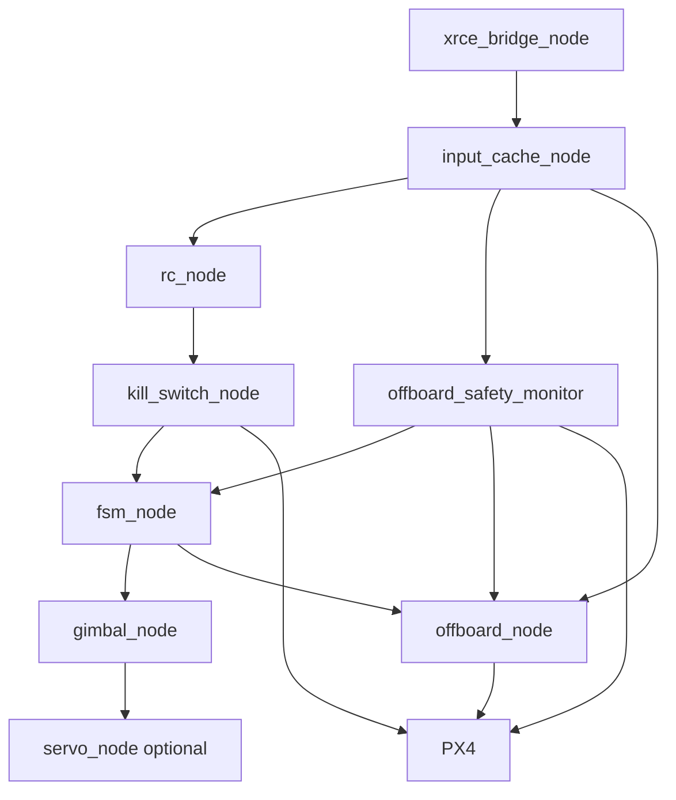

# VDT Project

Workspace prototype cho hệ thống UAV PX4 + ROS 2 thực hiện phát hiện, bám và hạ cánh lên H-Pad bằng vision. Hệ thống gồm bộ máy trạng thái bay, điều khiển Offboard, điều khiển gimbal/servo, nhận RC SBUS, các lớp giám sát an toàn và công cụ phân tích log sau chuyến bay.

> **Trạng thái:** Đây là skeleton tích hợp/prototype, chưa phải hệ thống sẵn sàng bay. Cần sửa các lỗi build và hoàn thiện kiểm thử an toàn được nêu trong [Các vấn đề cần xử lý](#các-vấn-đề-cần-xử-lý) trước khi kết nối phương tiện thật.

## Mục lục

- [Kiến trúc tổng quan](#kiến-trúc-tổng-quan)
- [Cấu trúc repository](#cấu-trúc-repository)
- [ROS 2 packages](#ros-2-packages)
- [Messages](#messages)
- [Topics chính](#topics-chính)
- [Tham số tập trung](#tham-số-tập-trung)
- [Sơ đồ launch](#sơ-đồ-launch)
- [Luồng hoạt động](#luồng-hoạt-động)
- [Cài đặt và build](#cài-đặt-và-build)
- [Chạy hệ thống](#chạy-hệ-thống)
- [Landing diagnostics](#landing-diagnostics)
- [Tích hợp PX4 và QGroundControl](#tích-hợp-px4-và-qgroundcontrol)
- [Kiểm thử và validation](#kiểm-thử-và-validation)
- [Các vấn đề cần xử lý](#các-vấn-đề-cần-xử-lý)
- [Tài liệu tham khảo trong repository](#tài-liệu-tham-khảo-trong-repository)

## Kiến trúc tổng quan

```text
PX4 / Vision / Altimeter / Planner / RC
                  |
                  v
          ROS 2 qua Micro XRCE-DDS
                  |
       +----------+-----------+
       |                      |
       v                      v
input_state_cache       FSM + Gimbal
       |                      |
       +----------+-----------+
                  v
          Offboard manager
                  |
                  v
             PX4 /fmu/in/*

PX4 status + battery + local position + offboard status
                  |
                  v
        offboard_safety_monitor
          |                  |
          v                  v
   safety/inhibit       safety/force_land

RC SBUS -> rc_parser -> kill_switch -> force disarm + system/killed
```

Các node tự lưu bản sao payload đầu vào của mình. `input_state_cache` chỉ lưu thời điểm nhận message và phát cờ timeout, không phải bộ nhớ payload trung tâm.

## Cấu trúc repository

| Đường dẫn | Nội dung |
|---|---|
| `ros2_ws/src/` | Mười ROS 2 packages của hệ thống bay và bringup |
| `ros2_ws/src/vdt_bringup/` | Launch orchestration và startup ordering |
| `landing_diagnostics/` | Ghi log, tính metric và đề xuất tuning từ CSV |
| `PX4_Control/` | Hướng dẫn và template patch cho PX4 |
| `Embedded_Plan.md` | Kế hoạch thiết kế embedded tổng thể |
| `PX4_Architecture.md` | Kiến trúc giao tiếp PX4/ROS 2 |
| `QGC_Calibration_Guide.md` | Quy trình calibration trên QGroundControl |
| `References/Link.txt` | Nguồn tham khảo và repository liên quan |

## Tham số tập trung

Các tham số runtime được khai báo trong [System_Params.yaml](System_Params.yaml). Khi chạy bằng `vdt_bringup`, file này được cài vào package và nạp cho mọi node. Giá trị trong launch arguments có thể ghi đè `debug_enabled`, `start_hardware` và `start_servo`.

| Node | Nhóm tham số |
|---|---|
| `input_cache_node` | `ekf_timeout_sec=0.5`, `vision_timeout_sec=0.5`, `alt_timeout_sec=0.5`, `planner_timeout_sec=1.0`, `debug_enabled=false` |
| `fsm_node` | `land_entry_height=0.5`, `yaw_search_rate=0.3`, `land_descent_rate=0.4`, `debug_enabled=false` |
| `gimbal_node` | `kp=1.0`, `ki=0.0`, `kd=0.1`, `out_min_deg=-90`, `out_max_deg=90`, `max_slew_rate_deg_s=60`, `land_entry_height=0.5`, `debug_enabled=false` |
| `offboard_node` | `required_engage_cycles=10`, `mode_confirm_timeout_cycles=20`, `health_confirm_timeout_cycles=100`, `data_freshness_timeout_sec=1.0`, `max_horizontal_velocity=2.0`, `max_vertical_velocity=1.0`, `max_yaw=3.14`, `watchdog_timeout_sec=0.5`, `yaw_search_rate=0.3`, `land_descent_rate=0.4`, `debug_enabled=false` |
| `safety_monitor_node` | `battery_warning_frac=0.3`, `battery_critical_frac=0.15`, `offboard_hold_timeout=1.0`, `offboard_rtl_timeout=5.0`, `data_freshness_timeout_sec=1.0`, `force_land_latched=true`, `debug_enabled=false` |
| `rc_node` | `serial_device=/dev/ttyUSB0`, `baudrate=100000`, `land_channel=4`, `kill_channel=5`, `low_threshold=1200`, `high_threshold=1800`, `frame_timeout=0.5`, `debug_enabled=false` |
| `kill_switch_node` | `kill_channel=5`, `low_threshold=1200`, `high_threshold=1800`, `debounce_threshold=3`, `debug_enabled=false` |
| `servo_node` | `gpio_pin=18`, `pwm_min_us=600`, `pwm_max_us=2400`, `angle_min_deg=0`, `angle_max_deg=180`, `home_angle_deg=90`, `input_timeout_sec=1.0`, `debug_enabled=false` |
| `xrce_bridge_node` | `serial_port=/dev/ttyAMA0`, `baudrate=921600`, `connection_timeout_sec=2.0`, `debug_enabled=false` |

Launch arguments:

| Argument | Mặc định | Ý nghĩa |
|---|---:|---|
| `start_hardware` | `true` | Bật `rc_node` và `kill_switch_node` |
| `start_servo` | `false` | Bật servo GPIO trên Raspberry Pi |
| `debug` | `false` | Ghi đè `debug_enabled` cho các node |

## Sơ đồ launch



Launch sequence theo thời gian là `XRCE -> input cache -> RC/kill -> safety -> FSM/gimbal -> Offboard -> servo`. Đây là thứ tự khởi tạo process; readiness thật vẫn do các node kiểm tra freshness, timeout, health và mode PX4.

## ROS 2 packages

### `fsm_state_machine` (C++)

Điều khiển chuỗi trạng thái:

```text
SEARCH -> FOLLOW -> APPROACH -> LAND -> COMPLETE
```

- Timer 10 Hz.
- Nhận odometry, marker vision, altitude, RC, timeout flags và yêu cầu force-land.
- Phát state, mode planner, yaw rate, descent rate, gimbal request và disarm request.
- `SEARCH -> FOLLOW` sau 10 chu kỳ marker ổn định.
- Mất marker đưa `FOLLOW -> SEARCH` sau 5 giây và `APPROACH -> FOLLOW` sau 3 giây.
- `FOLLOW -> APPROACH` khi land switch bật và marker còn nhìn thấy.
- `APPROACH -> LAND` khi sai số căn chỉnh nhỏ hơn `0.3` và chênh cao nhỏ hơn `land_entry_height`.
- `LAND -> COMPLETE` khi có touchdown flag.

Tham số chính: `land_entry_height=0.5`, `yaw_search_rate=0.3`, `land_descent_rate=0.4`.

### `gimbal_control` (C++)

Tính góc mục tiêu theo state và hình học tương đối giữa UAV với H-Pad. Góc đi qua PID phần mềm và slew-rate limiter trước khi phát trên `gimbal/target_angle_deg`.

- Timer 20 Hz.
- SEARCH: `0` độ.
- FOLLOW/APPROACH: `-atan2(delta_h, d_horiz)` đổi sang độ.
- LAND: nội suy từ `-60` đến `-90` độ.
- Mặc định PID: `kp=1.0`, `ki=0.0`, `kd=0.1`.
- Đây là điều khiển open-loop ở cấp servo; `current_angle_` là góc lệnh trước đó, không phải feedback vật lý. PID có anti-windup, finite-value checks và bảo vệ `land_entry_height`/slew rate khỏi dữ liệu không hợp lệ.

### `servo_control` (Python)

Điều khiển MG90S bằng `gpiozero.AngularServo` và `LGPIOFactory` trên Raspberry Pi/Linux.

```text
gimbal/target_angle_deg
  -> cộng home_angle_deg
  -> clamp [angle_min_deg, angle_max_deg]
  -> AngularServo.angle
```

Mặc định: GPIO `18`, PWM `600..2400 us`, góc servo `0..180`, home `90` độ, timeout input `1.0 s`. Khi mất lệnh gimbal quá timeout, servo trở về home; giá trị NaN/vô hạn bị bỏ qua. Package không chạy trực tiếp trên Windows hoặc PX4 flight controller. Xem [Servo_Guide.md](ros2_ws/src/servo_control/Servo_Guide.md).

### `input_state_cache` (C++)

Theo dõi freshness của EKF, vision, altitude và planner rồi phát `input_cache/timeout_flags`.

- Timer 20 Hz.
- Timeout mặc định: EKF `0.5 s`, vision `0.5 s`, altitude `0.5 s`, planner `1.0 s`.
- Chỉ kiểm tra thời điểm nhận, không kiểm tra tính hợp lệ của payload.

### `offboard_manager` (C++)

Chuyển state và planner output thành lệnh PX4:

- Timer 20 Hz.
- Phát `OffboardControlMode`, `TrajectorySetpoint` và `VehicleCommand`.
- Gửi 10 chu kỳ setpoint trước khi yêu cầu chuyển Offboard.
- Chờ `VehicleStatus.nav_state == OFFBOARD` từ message còn fresh trước khi tiếp tục.
- Chỉ arm khi `VehicleStatus` và `VehicleLocalPosition` đã nhận, còn fresh, EKF có `xy_valid/z_valid` và PX4 không ở failsafe.
- SEARCH dừng vị trí và quay theo `yaw_search_rate`.
- FOLLOW/APPROACH dùng velocity từ planner.
- LAND dừng vận tốc ngang và dùng `land_descent_rate`.

Tham số chính: `required_engage_cycles=10`, `mode_confirm_timeout_cycles=20`, `health_confirm_timeout_cycles=100`, `data_freshness_timeout_sec=1.0`, `max_horizontal_velocity=2.0`, `max_vertical_velocity=1.0`, `max_yaw=3.14`, `watchdog_timeout_sec=0.5`, `yaw_search_rate=0.3`, `land_descent_rate=0.4`. Planner output non-finite bị thay bằng setpoint an toàn và output hợp lệ bị clamp theo các giới hạn này.

### `offboard_safety_monitor` (C++)

Đánh giá RC override, EKF, pin và tuổi heartbeat Offboard. Các mức lỗi gồm `NONE`, `RC_OVERRIDE`, `EKF_UNHEALTHY`, `BATTERY_WARNING`, `BATTERY_CRITICAL`, `OFFBOARD_LOST_SHORT` và `OFFBOARD_LOST_LONG`.

- Timer 5 Hz.
- Pin warning dưới `30%`, critical dưới `15%`.
- Mất Offboard 1 giây: yêu cầu HOLD.
- Mất Offboard 5 giây: yêu cầu RTL.
- Phát lệnh PX4, `safety/inhibit_offboard` và `safety/force_land`.
- `force_land_requested` mặc định latch đến khi node restart; dùng `force_land_latched=false` chỉ cho bench/test với battery fresh và hợp lệ.
- Xem [Safety_Guide.md](ros2_ws/src/offboard_safety_monitor/Safety_Guide.md) để biết policy reset.

### `rc_parser` (C++)

Đọc SBUS qua UART, giải mã 16 channel 11-bit, đổi thành microseconds và phát dữ liệu RC.

- Mặc định `/dev/ttyUSB0`, `100000 baud`, 8E2.
- Land switch channel mặc định `4`, kill switch channel `5` (zero-based).
- Ngưỡng thấp/cao `1200/1800 us`.
- Frame timeout `0.5 s`.
- Phụ thuộc Linux/POSIX (`termios`, `TCGETS2`, `BOTHER`), không build native trên Windows. Return value của `ioctl/read` được kiểm tra; khi mất frame hoặc UART lỗi, node vẫn publish `valid=false`, `failsafe=true`.

### `kill_switch` (C++)

Debounce kill channel trong ba chu kỳ, sau đó latch trạng thái killed và gửi `VEHICLE_CMD_COMPONENT_ARM_DISARM` với force-disarm (`param2=21196`). Phát thêm `system/killed` với QoS transient-local.

Kill switch không tự kích hoạt khi mất RC; tuy nhiên khi đã publish `system/killed`, `fsm_state_machine` dừng update và `offboard_manager` reset engage, dừng heartbeat/setpoint.

### `xrce_bridge_manager` (Python)

Kiểm tra và khởi động `MicroXRCEAgent` bằng lệnh:

```bash
MicroXRCEAgent serial --dev <serial_port> -b <baudrate>
```

Mặc định dùng `/dev/ttyAMA0`, `921600 baud`, timeout kết nối `2.0 s`. Trạng thái connected yêu cầu Agent còn sống và `/fmu/out/vehicle_status` còn fresh; process chết hoặc status stale đều kích hoạt reconnect. Xem [XRCE_Guide.md](ros2_ws/src/xrce_bridge_manager/XRCE_Guide.md).

## Messages

| Package | Message | Trường |
|---|---|---|
| `fsm_state_machine` | `VisionMarker` | `marker_visible`, `pixel_align_error` |
| `fsm_state_machine` | `AltEstimate` | `altitude`, `touchdown_flag` |
| `fsm_state_machine` | `RcFsmInput` | `land_switch`, `kill_switch` |
| `fsm_state_machine` | `TimeoutFlags` | `ekf_timeout`, `vision_timeout`, `alt_timeout`, `planner_timeout` |
| `rc_parser` | `RcChannelsRaw` | `int16[16] ch`, `valid`, `failsafe` |
| `offboard_manager` | `PlannerOutput` | `vx`, `vy`, `vz`, `yaw` |
| `offboard_manager` | `OffboardStatus` | `offboard_active`, `heartbeat_age_sec` |

Repository hiện không định nghĩa service hoặc action interface.

## Topics chính

### Input của FSM

| Topic | Type |
|---|---|
| `hpad/state_filtered` | `nav_msgs/msg/Odometry` |
| `hpad/pose` | `fsm_state_machine/msg/VisionMarker` |
| `alt_estimator/state` | `fsm_state_machine/msg/AltEstimate` |
| `rc/fsm_input` | `fsm_state_machine/msg/RcFsmInput` |
| `input_cache/timeout_flags` | `fsm_state_machine/msg/TimeoutFlags` |
| `safety/force_land` | `std_msgs/msg/Bool` |

### Output nội bộ

`fsm/state`, `cmd/yaw_rate`, `gimbal/state_request`, `planner/mode`, `planner/apf_gain`, `gimbal/align_error_cmd`, `cmd/vertical_descent_rate`, `cmd/disarm_request`, `gimbal/target_angle_deg`, `rc/fsm_input`, `rc/channels_raw`, `offboard/status`, `safety/inhibit_offboard`, `safety/force_land`, `system/killed`.

### Giao tiếp PX4

- Input từ PX4: `/fmu/out/vehicle_status`, `/fmu/out/vehicle_local_position`, `/fmu/out/battery_status`.
- Output đến PX4: `/fmu/in/offboard_control_mode`, `/fmu/in/trajectory_setpoint`, `/fmu/in/vehicle_command`.

Tên topic và message PX4 còn phụ thuộc phiên bản `px4_msgs`, firmware PX4 và cấu hình `dds_topics.yaml`.

## Luồng hoạt động

1. `xrce_bridge_manager` kết nối ROS 2 với PX4 qua Micro XRCE-DDS.
2. Vision, estimator, planner và RC đưa dữ liệu vào ROS 2.
3. `input_state_cache` phát các cờ timeout khi nguồn dữ liệu không còn mới.
4. FSM quyết định phase bay và phát lệnh cho planner, gimbal và Offboard manager.
5. Gimbal tính góc camera; `servo_control` biến góc điều khiển thành góc servo vật lý.
6. Offboard manager phát heartbeat và velocity setpoint đến PX4.
7. Safety monitor có thể yêu cầu HOLD, RTL, force-land hoặc inhibit Offboard.
8. Kill switch hoạt động độc lập để force disarm.

## Cài đặt và build

### Phụ thuộc

- ROS 2 với `ament_cmake` và `ament_python`.
- `rclcpp`, `rclpy`, `std_msgs`, `nav_msgs`, `px4_msgs`.
- `rosidl_default_generators`, `rosidl_default_runtime`.
- `MicroXRCEAgent`.
- Raspberry Pi: `gpiozero`, `lgpio`.
- Phần cứng UART và SBUS inverter phù hợp.
- QGroundControl cho calibration và tuning.

### Build ROS 2

Thực hiện trên Linux có ROS 2 đã cài:

```bash
cd ros2_ws
source /opt/ros/<ros_distro>/setup.bash
rosdep install --from-paths src --ignore-src -r -y
colcon build
source install/setup.bash
```

Đã có launch file `vdt_bringup` và [System_Params.yaml](System_Params.yaml) làm cấu hình tập trung; vẫn chưa có CI. Launch file nạp YAML và sắp xếp thứ tự khởi động, còn readiness thực tế được kiểm tra trong từng node. Các bước engage/arm cần được kiểm thử với PX4 SITL trước khi dùng phần cứng.

### Build diagnostics

```bash
cd landing_diagnostics
python3 -m venv .venv
source .venv/bin/activate
pip install -r requirements.txt
```

`requirements.txt` gồm `pandas` và `numpy`. Logger còn cần môi trường ROS 2, `px4_msgs` và `fsm_state_machine`.

## Chạy hệ thống

Khuyến nghị dùng launch orchestration:

```bash
source /opt/ros/<ros_distro>/setup.bash
source ros2_ws/install/setup.bash
ros2 launch vdt_bringup vdt_system.launch.py
```

Các tùy chọn bench:

```bash
ros2 launch vdt_bringup vdt_system.launch.py start_hardware:=false
ros2 launch vdt_bringup vdt_system.launch.py start_servo:=true
ros2 launch vdt_bringup vdt_system.launch.py debug:=true
```

Launch sequence là XRCE → input cache → RC/kill → safety → FSM/gimbal → Offboard → servo. Delay chỉ điều phối startup; readiness safety vẫn được kiểm tra trong node. Có thể chạy từng node riêng khi debug:

```bash
source /opt/ros/<ros_distro>/setup.bash
source ros2_ws/install/setup.bash

ros2 run xrce_bridge_manager xrce_bridge_node
ros2 run input_state_cache input_cache_node
ros2 run rc_parser rc_node
ros2 run kill_switch kill_switch_node
ros2 run offboard_safety_monitor safety_monitor_node
ros2 run fsm_state_machine fsm_node
ros2 run gimbal_control gimbal_node
ros2 run offboard_manager offboard_node
ros2 run servo_control servo_node
```

Thứ tự trên chỉ là thứ tự khởi động đề xuất, không thay thế launch system hoặc readiness handshake. Không thử arm hoặc chạy với cánh lắp trong giai đoạn validation.

Một số lệnh kiểm tra thủ công hữu ích:

```bash
ros2 topic list
ros2 topic echo /fmu/out/vehicle_status
ros2 topic echo /fmu/out/battery_status
ros2 topic echo offboard/status
ros2 topic echo input_cache/timeout_flags
```

## Lưu ý lắp ráp và nối dây Pi 5

Các bước này phải hoàn tất trước khi chạy node thật:

1. **Nguồn:** dùng nguồn USB-C ổn định cho Pi 5, đủ công suất cho Pi và thiết bị USB/UART. Không lấy nguồn servo MG90S trực tiếp từ chân 5 V của Pi nếu servo có thể tải lớn; dùng nguồn 5 V riêng có giới hạn dòng và nối chung `GND` với Pi.
2. **Mức logic:** GPIO/UART của Pi 5 là 3.3 V. Không đưa tín hiệu 5 V hoặc 6 V trực tiếp vào GPIO/UART; dùng level shifter phù hợp. Không cấp ngược điện áp vào chân GPIO.
3. **Servo:** mặc định dùng GPIO `18`. Kiểm tra đúng dây signal/5 V/GND, giới hạn cơ khí trước khi lắp linkage, và đặt servo ở home trước khi gắn cơ cấu. Dây nguồn servo nên ngắn, có đầu nối chắc và tách khỏi dây tín hiệu nhạy.
4. **SBUS/UART:** kiểm tra đúng UART device trong `System_Params.yaml`, cấu hình `100000 baud, 8E2`, và dùng inverter nếu receiver SBUS yêu cầu tín hiệu đảo. Không nối đồng thời nhiều thiết bị vào cùng UART.
5. **PX4/XRCE:** kiểm tra đúng cổng serial, baudrate `921600`, TX/RX đấu chéo, `GND` chung và mức logic tương thích với flight controller. Không cắm/rút dây tín hiệu khi hệ thống đang cấp nguồn.
6. **Chống chập và nhiễu:** đo thông mạch, cực tính và điện áp bằng đồng hồ trước khi cắm Pi/PX4. Cố định dây, bọc mối hàn, tránh dây servo/UART chạy sát dây nguồn motor/ESC; thêm strain relief ở đầu nối.
7. **Tản nhiệt:** lắp heatsink/quạt phù hợp cho Pi 5 trong hộp kín; không đặt Pi sát ESC, regulator hoặc nguồn tỏa nhiệt. Theo dõi nhiệt độ và throttling khi chạy stress test.
8. **Khởi động an toàn:** lần đầu chạy với `start_servo:=false`, tháo cánh/không nối tải chuyển động, kiểm tra `ros2 topic echo`, rồi mới bật servo và kiểm tra từng actuator ở tốc độ thấp.
9. **Dừng khẩn:** phải có cách ngắt nguồn phần công suất độc lập với phần mềm. `kill_switch`/force-disarm không thay thế công tắc nguồn, cầu chì hoặc mạch bảo vệ phần cứng.

Checklist trước khi cấp nguồn:

```text
[ ] Đúng cực tính và điện áp ở từng đầu nối
[ ] Pi/PX4/servo có GND chung theo sơ đồ
[ ] Servo dùng nguồn riêng phù hợp, không quá tải rail 5 V của Pi
[ ] GPIO/UART không nhận tín hiệu vượt 3.3 V
[ ] SBUS inverter và TX/RX đã xác nhận
[ ] Cầu chì/ngắt nguồn phần công suất hoạt động
[ ] Cánh và cơ cấu chuyển động đã tháo hoặc được cố định
[ ] Có heatsink/quạt và thông gió
```

Không thể chứng minh chỉ bằng code rằng Pi sẽ không cháy hoặc hỏng. Việc đó cần xác nhận bằng đo điện áp/dòng, kiểm tra nhiệt độ/throttling, thử tải có giới hạn và bảo vệ phần cứng độc lập.

## Landing diagnostics

`landing_diagnostics` cung cấp pipeline phân tích log:

```text
flight_data_logger -> CSV -> metrics -> classify -> tuning -> report
```

Logger ghi dữ liệu khoảng 50 ms, gồm position, velocity, trajectory setpoint, trạng thái PX4, FSM state, touchdown và landed flag. Metrics chỉ lấy các dòng `fsm_state == 3` (LAND), sau đó tính:

- Sai số velocity trung bình, lớn nhất và độ lệch chuẩn.
- Sai số vận tốc X/Y.
- Tần số trội bằng FFT.
- Tương quan altitude và error.
- Drift ngang trong phase LAND.

Classifier nhận diện `underdamped`, `steady_state_offset`, `ground_effect` hoặc `setpoint_or_estimator_issue`. Tuning đề xuất thay đổi `MPC_XY_VEL_P_ACC`, `MPC_XY_VEL_D_ACC`, `MPC_XY_VEL_I_ACC`, `MPC_LAND_SPEED` và `MPC_LAND_ALT2` theo từng loại lỗi.

Chạy report:

```bash
python3 -m landing_diagnostics.report flight_log.csv --params-json current_params.json
```

File `current_params.json` là input tùy chọn và chưa có sẵn trong repository. Pipeline kiểm tra schema, ép numeric, loại NaN/vô hạn, loại timestamp trùng và yêu cầu timestamp LAND tăng dần cùng tối thiểu 5 mẫu hợp lệ. Xem [Diagnostic_Guide.md](landing_diagnostics/Diagnostic_Guide.md).

## Tích hợp PX4 và QGroundControl

- [PX4_Architecture.md](PX4_Architecture.md) mô tả kiến trúc PX4/ROS 2.
- [PX4_Control/Patch_Guide.md](PX4_Control/Patch_Guide.md) mô tả quy trình patch PX4.
- `PX4_Control/templates/velocity_pid_patch_template.cpp` là template điều chỉnh velocity PID.
- `PX4_Control/templates/param_template.c` là template khai báo parameter.
- `PX4_Control/templates/apply_patch.sh` áp dụng các patch trong `../patches/*.patch`.
- [QGC_Calibration_Guide.md](QGC_Calibration_Guide.md) mô tả calibration bằng QGroundControl.

Các file trong `PX4_Control/templates` chưa phải patch hoàn chỉnh: chưa khóa phiên bản PX4, chưa có patch thực tế, chưa cập nhật đầy đủ header/parameter declaration và chưa có test chứng minh tham số hoạt động.

## Kiểm thử và validation

Hiện có thể kiểm tra thủ công bằng `ros2 topic pub`, `ros2 topic echo`, debug logs và SITL theo các guide của từng package. Đã có unit test C++ cho các logic thuần của FSM, Offboard, Gimbal, Safety và RC; chạy bằng:

```bash
cd ros2_ws
colcon test --packages-select fsm_state_machine offboard_manager gimbal_control offboard_safety_monitor rc_parser
colcon test-result --verbose
```

Các phần chưa có:
- Vector test SBUS đầy đủ, sample flight log hoặc CI build/lint.

Chạy unit test Python:

```bash
python3 -m pip install pytest
python3 -m pytest ros2_ws/src/servo_control/test/test_servo_logic.py
python3 -m pytest ros2_ws/src/xrce_bridge_manager/test/test_xrce_logic.py
python3 -m pip install -r landing_diagnostics/requirements.txt
python3 -m pytest landing_diagnostics/test_metrics.py
```

Integration test của safety monitor đã có và chạy cùng `colcon test`. HIL runtime harness kiểm tra freshness, `OffboardStatus`, `VehicleCommandAck` accepted cho mode/arm và PX4 xác nhận Offboard trên PX4 SITL/HIL hoặc vehicle được cố định:

```bash
ros2 run offboard_safety_monitor hil_validation.py --duration 5
```

Chỉ bỏ qua ACK khi chạy monitor bench:

```bash
ros2 run offboard_safety_monitor hil_validation.py --duration 5 --skip-command-ack
```

Trước khi bay nên kiểm tra tối thiểu: FSM transitions, timeout startup, force-land, kill switch, HOLD/RTL, freshness của `VehicleStatus`/`VehicleLocalPosition`, PX4 mode acknowledgement, planner velocity bounds và behavior khi XRCE/RC bị ngắt.

## Các vấn đề cần xử lý

### Mức tài liệu và phát hành

- Khóa phiên bản ROS 2, PX4 và `px4_msgs`.

## Tài liệu tham khảo trong repository

- [Embedded_Plan.md](Embedded_Plan.md)
- [PX4_Architecture.md](PX4_Architecture.md)
- [QGC_Calibration_Guide.md](QGC_Calibration_Guide.md)
- [landing_diagnostics/Diagnostic_Guide.md](landing_diagnostics/Diagnostic_Guide.md)
- [ros2_ws/src/fsm_state_machine/FSM_Guide.md](ros2_ws/src/fsm_state_machine/FSM_Guide.md)
- [ros2_ws/src/gimbal_control/Gimbal_Guide.md](ros2_ws/src/gimbal_control/Gimbal_Guide.md)
- [ros2_ws/src/servo_control/Servo_Guide.md](ros2_ws/src/servo_control/Servo_Guide.md)
- [ros2_ws/src/input_state_cache/ISC_Guide.md](ros2_ws/src/input_state_cache/ISC_Guide.md)
- [ros2_ws/src/offboard_manager/Offboard_Guide.md](ros2_ws/src/offboard_manager/Offboard_Guide.md)
- [ros2_ws/src/offboard_safety_monitor/Safety_Guide.md](ros2_ws/src/offboard_safety_monitor/Safety_Guide.md)
- [ros2_ws/src/rc_parser/RC_Guide.md](ros2_ws/src/rc_parser/RC_Guide.md)
- [ros2_ws/src/xrce_bridge_manager/XRCE_Guide.md](ros2_ws/src/xrce_bridge_manager/XRCE_Guide.md)
- [References/Link.txt](References/Link.txt)