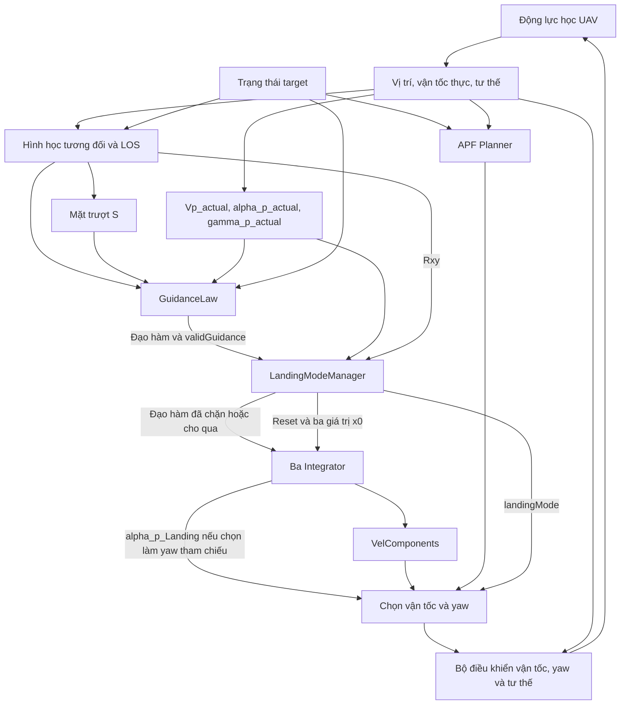

# VDT_project
 Hệ thống bám mục tiêu động thời gian thực và tránh vật cản tự động cho Quadrotors sử dụng ROS 2, PX4 Autopilot, YOLO + ByteTrack, EKF và Improved APF.
[APF Planner 2D for Quadrotor](https://github.com/duytranvan6904/VDT_project/tree/Tu%C3%A2n#apf-planner-2d-for-quadrotor)
[IAPF Planner 3D for Quadrotor](https://github.com/duytranvan6904/VDT_project/tree/Tu%C3%A2n#iapf-planner-3d-for-quadrotor)
[Soft Landing for Quadrotor](https://github.com/duytranvan6904/VDT_project/tree/Tu%C3%A2n#soft-landing-for-quadrotor)
# APF Planner 2D for Quadrotor

Hàm `APFplanner_1_Obstacle` sử dụng phương pháp **Artificial Potential Field (APF)** để tạo lệnh vận tốc cho UAV 2D, dựa trên vị trí hiện tại, vị trí đích và vị trí các vật cản.

## Cú pháp

```matlab
[V_cmd, yaw_cmd, Stop] = APF_Planner(pos, goal, obs, numobs)
```

## Đầu vào

| Tên | Kích thước | Mô tả | Đơn vị |
|---|---|---|---|
| `pos` | `1×3` | Vị trí hiện tại của UAV `[N E D]` | m |
| `goal` | `1×3` | Vị trí đích `[N E D]` | m |
| `obs` | `N×3` | Tọa độ các vật cản `[N E D]` | m |
| `numobs` | `1×1` | Số lượng vật cản được xét | - |

Trong đó:

- `N`: số lượng vật cản.
- Hệ tọa độ sử dụng là **NED (North-East-Down)**.
- `obs(i,:)` là tọa độ của vật cản thứ `i`.

Ví dụ:

```matlab
pos = [0 0 0];
goal = [20 10 -5];

obs = [
    5  2  0;
    10 5 -2;
    15 8 -3
];

numobs = 3;
```

## Đầu ra

| Tên | Kích thước | Mô tả | Đơn vị |
|---|---|---|---|
| `V_cmd` | `1×3` | Lệnh vận tốc `[VN VE VD]` | m/s |
| `yaw_cmd` | `1×1` | Góc yaw mong muốn | rad |
| `Stop` | `1×1` | Cờ báo UAV đã đến đích | - |

### `V_cmd`

```text
V_cmd = [VN VE VD]
```

Trong đó:

- `VN`: vận tốc theo hướng North
- `VE`: vận tốc theo hướng East
- `VD`: vận tốc theo hướng Down

Giá trị vận tốc được giới hạn bởi:

```matlab
v_max = 2;   % m/s
```

### `yaw_cmd`

Góc yaw được tính theo hướng chuyển động ngang của UAV:

```matlab
yaw_cmd = atan2(VE, VN);
```

### `Stop`

```text
Stop = 0  → UAV chưa đến đích
Stop = 1  → UAV đã đến đích
```

UAV được xem là đến đích khi khoảng cách tới goal nhỏ hơn:

```matlab
0.15 m
```

## Tham số chính

```matlab
d0   = 5;       % Khoảng cách ảnh hưởng của vật cản (m)
v_max = 2;      % Vận tốc tối đa (m/s)
katt = 10;      % Hệ số lực hút
krep = 90000;   % Hệ số lực đẩy
```

Vật cản chỉ tạo lực đẩy khi:

```text
distance ≤ d0
```

Tóm lại:

```text
Input:
pos    [1×3]
goal   [1×3]
obs    [N×3]
numobs [1×1]

        ↓

     APF Planner

        ↓

Output:
V_cmd   [1×3]
yaw_cmd [1×1]
Stop    [1×1]
```
# IAPF Planner 3D for Quadrotor

Hàm `IAPF_Planner_3D_MultiObs` triển khai thuật toán **Improved Artificial Potential Field (IAPF)** để tạo lệnh vận tốc cho UAV trong không gian 3D.

Thuật toán gồm ba phần chính:

- Lực hút đưa UAV về phía goal.
- Lực đẩy giúp UAV tránh vật cản và giảm hiện tượng goal nằm gần obstacle nhưng UAV không tới được đích.
- Cơ chế xử lý local minimum và oscillation để UAV thoát vùng cân bằng cục bộ và giảm đổi hướng liên tục khi bay gần vật cản.

## Cú pháp

```matlab
[V_cmd, yaw_cmd, Stop] = IAPF_Planner_3D_MultiObs(pos, goal, obs, katt, krep, d0, v_max, numobs)
```

## Đầu vào

| Tên | Kích thước | Ý nghĩa | Đơn vị |
|---|---:|---|---|
| `pos` | `1×3` | Vị trí hiện tại của UAV `[N E D]` | m |
| `goal` | `1×3` | Vị trí đích `[N E D]` | m |
| `obs` | `N×3` | Tọa độ các vật cản `[N E D]` | m |
| `katt` | `1×1` | Hệ số lực hút | - |
| `krep` | `1×1` | Hệ số lực đẩy | - |
| `d0` | `1×1` | Khoảng cách ảnh hưởng của vật cản | m |
| `v_max` | `1×1` | Vận tốc cực đại của UAV | m/s |
| `numobs` | `1×1` | Số lượng vật cản được xét | - |

Trong đó:

- `N` là số lượng vật cản.
- `obs(i,:)` là tọa độ của vật cản thứ `i`.
- Hệ tọa độ sử dụng là **NED (North-East-Down)**.

Ví dụ:

```matlab
pos  = [0 0 0];
goal = [20 10 -5];

obs = [
     5  2  0;
    10  5 -2;
    15  8 -3
];

katt   = 10;
krep   = 100;
d0     = 5;
v_max  = 2;
numobs = 3;
```

## Đầu ra

| Tên | Kích thước | Ý nghĩa | Đơn vị |
|---|---:|---|---|
| `V_cmd` | `1×3` | Lệnh vận tốc `[VN VE VD]` | m/s |
| `yaw_cmd` | `1×1` | Góc yaw mong muốn | rad |
| `Stop` | `1×1` | Cờ báo UAV đã tới goal | - |

### `V_cmd`

```text
V_cmd = [VN VE VD]
```

Trong đó:

- `VN`: vận tốc theo hướng North.
- `VE`: vận tốc theo hướng East.
- `VD`: vận tốc theo hướng Down.

### `yaw_cmd`

Góc yaw được tính theo hướng chuyển động ngang của UAV:

```matlab
yaw_cmd = atan2(V_cmd(2), V_cmd(1));
```

### `Stop`

```text
Stop = 0  -> UAV chưa tới goal
Stop = 1  -> UAV đã tới goal
```

---

## Mô tả thuật toán

### 1. Tính khoảng cách và hướng tới goal

Từ vị trí hiện tại `pos` và vị trí đích `goal`, thuật toán xác định:

- Khoảng cách từ UAV tới goal.
- Vector hướng từ UAV tới goal.
- Vector đơn vị `dir_goal` dùng để xác định hướng di chuyển mong muốn.

Nếu khoảng cách tới goal nhỏ hơn ngưỡng cho trước, UAV được xem là đã tới đích và `Stop = 1`.

---

### 2. Tính Attractive Force

Attractive force có nhiệm vụ kéo UAV về phía goal.

Độ lớn lực hút phụ thuộc vào:

- Khoảng cách từ UAV tới goal.
- Hệ số `katt`.

Khi UAV ở xa goal, lực hút lớn hơn. Khi UAV tiến gần goal, lực hút giảm dần.

---

### 3. Tính Improved Repulsive Force

Repulsive force có nhiệm vụ đẩy UAV ra xa vật cản.

Mỗi vật cản chỉ tạo lực đẩy khi UAV nằm trong vùng ảnh hưởng:

```text
distance_to_obstacle <= d0
```

Lực đẩy được chia thành hai thành phần:

- `F_rep1`: đẩy UAV ra xa vật cản.
- `F_rep2`: bổ sung thành phần hướng về goal.

Cách này giúp giảm hiện tượng UAV không thể tới goal khi goal nằm gần vật cản.

Tổng lực đẩy được tính bằng tổng đóng góp của tất cả vật cản.

---

### 4. Tính tổng lực APF

Tổng lực điều hướng cơ bản được tính từ:

```text
F_total = F_att + F_rep
```

Trong điều kiện bình thường, hướng của `F_total` được dùng làm hướng chuyển động của UAV.

---

### 5. Phát hiện Local Minimum

Local minimum xảy ra khi lực hút và lực đẩy gần như cân bằng nhau làm tổng lực rất nhỏ.

Thuật toán kiểm tra:

```text
norm(F_total) < F_enter
```

đồng thời UAV vẫn còn cách goal và đang ở gần vật cản.

Khi thỏa điều kiện này, chế độ tìm hướng tiếp tuyến được kích hoạt.

---

### 6. Hysteresis cho Local Minimum

Để tránh việc tangent liên tục bật và tắt quanh cùng một ngưỡng, thuật toán sử dụng hai ngưỡng:

```matlab
F_enter
F_exit
```

Trong đó:

```text
F_exit > F_enter
```

Logic:

```text
norm(F_total) < F_enter
        -> bật tangent

F_enter <= norm(F_total) <= F_exit
        -> giữ tangent

norm(F_total) > F_exit
        -> tắt tangent
```

Cơ chế này giúp hệ thống ổn định hơn khi UAV vừa thoát khỏi local minimum.

---

### 7. Xác định Vector Pháp Tuyến

Khi local minimum được phát hiện, thuật toán tìm vật cản gần UAV nhất.

Vector pháp tuyến được lấy theo hướng từ vật cản tới UAV:

```text
normal = pos - obs_near
```

Sau đó chuẩn hóa để thu được vector đơn vị `n`.

Vector này được dùng để xây dựng mặt phẳng tiếp tuyến quanh vật cản.

---

### 8. Xây dựng Tangent Plane

Trong không gian 3D, có nhiều hướng tiếp tuyến quanh vật cản.

Thuật toán xây dựng hai vector cơ sở `e1` và `e2` nằm trên mặt phẳng tiếp tuyến.

Từ hai vector này, nhiều hướng tiếp tuyến khác nhau có thể được sinh ra để tìm hướng thoát local minimum tốt nhất.

---

### 9. Sinh các Tangent Candidate

Thuật toán tạo `N_tangent` hướng tiếp tuyến phân bố đều trên mặt phẳng tiếp tuyến.

Ví dụ:

```matlab
N_tangent = 12;
```

tương ứng với 12 hướng candidate khác nhau.

Mỗi hướng được đánh giá trước khi chọn làm hướng thoát local minimum.

---

### 10. Đánh giá Tangent Candidate

Mỗi tangent candidate được đánh giá theo ba tiêu chí:

#### Hướng về goal

Candidate được ưu tiên nếu nó giúp UAV tiếp tục tiến về phía goal.

#### Khoảng trống phía trước

Thuật toán dự đoán một số vị trí phía trước theo hướng candidate và kiểm tra khoảng cách tới các vật cản.

Hướng có khoảng trống lớn hơn sẽ được ưu tiên.

#### Duy trì hướng trước đó

Hướng tangent trước được lưu lại trong `tangent_prev`.

Candidate gần với hướng trước sẽ được ưu tiên để tránh việc UAV liên tục đổi phía khi vòng qua obstacle.

---

### 11. Chọn Tangent Tốt Nhất

Sau khi tính score cho tất cả candidate, hướng có score lớn nhất được chọn:

```text
best_tangent
```

Lực tiếp tuyến được tạo:

```text
F_tan = k_tan * best_tangent
```

Khi local minimum đang active:

```text
F_cmd_raw = F_total + F_tan
```

Khi không có local minimum:

```text
F_cmd_raw = F_total
```

Như vậy tangent chỉ được sử dụng khi cần thiết, không được cộng liên tục vào lực tổng hợp.

---

### 12. Giảm Oscillation

Khi UAV bay gần vật cản, hướng APF có thể thay đổi nhanh giữa các bước tính toán.

Thuật toán lưu hướng chuyển động trước đó:

```text
prev_move_dir
```

sau đó so sánh với hướng mới.

Nếu góc thay đổi nhỏ, hướng mới được sử dụng với trọng số tương đối lớn.

Nếu góc thay đổi lớn, thuật toán tăng trọng số của hướng trước để tránh UAV đổi hướng đột ngột.

Cơ chế này giúp giảm hiện tượng zig-zag khi UAV bay gần vật cản.

---

### 13. Speed Scheduling

Sau khi xác định hướng bay, thuật toán điều chỉnh độ lớn vận tốc.

UAV sẽ:

- Giảm tốc khi tiến gần goal.
- Giảm tốc khi tiến gần vật cản.
- Duy trì một vận tốc tối thiểu khi đang thoát local minimum.

Vận tốc cuối cùng được giới hạn bởi:

```matlab
v_max
```

---

### 14. Tính `V_cmd`

Sau khi xác định hướng và độ lớn vận tốc:

```text
V_cmd = speed * move_direction
```

Kết quả:

```text
V_cmd = [VN VE VD]
```

được gửi tới tầng điều khiển UAV.

---

### 15. Tính `yaw_cmd`

Yaw được tính dựa trên hướng vận tốc trong mặt phẳng North-East:

```matlab
yaw_cmd = atan2(V_cmd(2), V_cmd(1));
```

Nhờ đó UAV có thể quay theo hướng chuyển động mong muốn.

---

## Luồng xử lý tổng quát

```text
Input:
pos, goal, obs
katt, krep, d0
v_max, numobs

        |
        v

Tính khoảng cách tới goal

        |
        v

Tính Attractive Force

        |
        v

Tính Improved Repulsive Force

        |
        v

F_total = F_att + F_rep

        |
        v

Kiểm tra Local Minimum

        |
        +----------------------+
        |                      |
       Có                     Không
        |                      |
        v                      |
Tìm tangent tốt nhất           |
        |                      |
        v                      |
F_total + F_tan                |
        |                      |
        +----------+-----------+
                   |
                   v

Giảm Oscillation

                   |
                   v

Speed Scheduling

                   |
                   v

Output:
V_cmd
yaw_cmd
Stop
```

---

## Các tham số chính

```matlab
goal_tol      = 0.30;   % Ngưỡng xác định UAV đã tới goal
F_enter       = 0.10;   % Ngưỡng bật tangent
F_exit        = 0.30;   % Ngưỡng tắt tangent
goal_min_dist = 0.50;   % Khoảng cách tối thiểu tới goal để xét local minimum

k_tan         = 1.0;    % Hệ số lực tiếp tuyến
N_tangent     = 12;     % Số tangent candidate
N_pred        = 3;      % Số bước dự đoán phía trước

w_goal        = 1.0;    % Trọng số hướng về goal
w_clear       = 1.0;    % Trọng số khoảng trống
w_prev        = 0.60;   % Trọng số duy trì hướng trước
```

---

## Tóm tắt

```text
Input:
pos      [1×3]
goal     [1×3]
obs      [N×3]
katt     [1×1]
krep     [1×1]
d0       [1×1]
v_max    [1×1]
numobs   [1×1]

          |
          v

      IAPF Planner

          |
          v

Output:
V_cmd    [1×3]
yaw_cmd  [1×1]
Stop     [1×1]
```

Thuật toán IAPF hiện tại kết hợp:

```text
Attractive Force
        +
Improved Repulsive Force
        +
Local Minimum Detection
        +
Dynamic Tangent Search
        +
Forward-looking
        +
Oscillation Suppression
        +
Speed Scheduling
```

để tạo lệnh vận tốc 3D cho UAV tránh vật cản và tiến tới goal.

# Soft Landing for Quadrotor

Tài liệu mô tả mô hình Simulink đang xây dựng: UAV dùng **IAPF để tiếp cận và bám Hpad**, sau đó chuyển một chiều sang **Soft Landing bằng Sliding Mode Control**. Bộ điều khiển vận tốc và mô hình động lực học UAV nhận lệnh từ pha đang được chọn. Thuật toán này có thể triển khai cho Hpad di động tuy nhiên trong mô phỏng Hpad được giả định đứng yên (Vận tốc và gia tốc = 0). Code Matlab của các khối nằm trong folder Soft Landing. Tham số mô phỏng lấy trong file Parameters.m


## 1. Các khối chính

| Khối | Nhiệm vụ | Đầu ra chính |
|---|---|---|
| APF_Planner | Tạo lệnh tiếp cận/bám target từ vị trí UAV, target và thông tin vật cản | Vector vận tốc APF và yaw APF |
| VelocityToFlightState.m | Đổi vận tốc đo được sang tốc độ và góc quỹ đạo | `Vp_actual`, `alpha_p_actual`, `gamma_p_actual` |
| DistUAVtoHpad.m | Tính khoảng cách và góc của đường ngắm | `Rxy`, `psi` |
| SlidingSurface.m | Biểu diễn sai số khoảng cách và các ràng buộc góc | `S = [S1; S2; S3]` |
| GuidanceLaw.m | Giải hệ phương trình dẫn đường, bảo vệ số và giới hạn lệnh | Ba đạo hàm và `validGuidance` |
| LandingModeManager.m | Chốt pha, chốt giá trị khởi tạo, phát reset và cho phép/chặn đạo hàm | `landingMode`, `resetIntegrator`, ba `x0`, ba đạo hàm vào Integrator |
| HoriRangeRate.m | Tính tốc độ thay đổi của đường ngắm LOS | `dRxy` |
| LOSRate.m | Tính tốc độ thay đổi của góc đường ngắm LOS và xuất cờ valid tránh điểm kỳ dị khi Rxy tiến đến 0 | `dpsi` và `valid` |
| VerticalDist.m | Tính khoảng cách theo trục Z và tốc độ thay đổi khoảng cách theo trục Z giữa UAV và Hpad | `Rz` và `dRz` |
| VelComponents.m | Đổi trạng thái tham chiếu Landing sang vận tốc Cartesian | Vector vận tốc Landing |
| LandingStop.m | Điều kiện để nhận biết đã chạm đến Hpad và ngắt động cơ | `stop` |
| Ba Integrator | Tạo tham chiếu tốc độ và góc quỹ đạo Landing | `Vp_Landing`, `alpha_p_Landing`, `gamma_p_Landing` |
| Hai Switch | Chọn lệnh vận tốc và yaw từ APF hoặc Landing | Lệnh đưa vào bộ điều khiển UAV |

## 2. Sơ đồ luồng tín hiệu


```mermaid
flowchart TD
    UAV[Động lực học UAV] --> MEAS[Vị trí, vận tốc thực, tư thế]
    TARGET[Trạng thái target] --> APF[APF Planner]
    MEAS --> APF
    MEAS --> STATES[Vp_actual, alpha_p_actual, gamma_p_actual]
    MEAS --> LOS[Hình học tương đối và LOS]
    TARGET --> LOS
    LOS --> SURFACE[Mặt trượt S]
    LOS --> GUIDANCE[GuidanceLaw]
    SURFACE --> GUIDANCE
    STATES --> GUIDANCE
    TARGET --> GUIDANCE
    GUIDANCE -->|Đạo hàm và validGuidance| MANAGER[LandingModeManager]
    STATES --> MANAGER
    LOS -->|Rxy| MANAGER
    MANAGER -->|Đạo hàm đã chặn hoặc cho qua| INTS[Ba Integrator]
    MANAGER -->|Reset và ba giá trị x0| INTS
    INTS --> VEL[VelComponents]
    INTS -->|alpha_p_Landing nếu chọn làm yaw tham chiếu| SELECT[Chọn vận tốc và yaw]
    VEL --> SELECT
    APF --> SELECT
    MANAGER -->|landingMode| SELECT
    SELECT --> CONTROL[Bộ điều khiển vận tốc, yaw và tư thế]
    MEAS --> CONTROL
    CONTROL --> UAV
```

Hai luồng chạy song song:

1. **Luồng APF:** tạo lệnh tiếp cận/bám target.
2. **Luồng Landing:** tính guidance và kiểm tra khả năng chuyển pha. Trước chuyển pha, đạo hàm đưa vào Integrator bị chặn về `0`.

GuidanceLaw vẫn được tính trong pha APF để có `validGuidance`. Nếu chỉ bật GuidanceLaw sau khi `landingMode = 1`, điều kiện chuyển pha sẽ thiếu cờ hợp lệ để bắt đầu.

## 3. Hệ tọa độ và ý nghĩa các góc

Các công thức dưới đây dùng vận tốc và vị trí trong cùng hệ **NED**:

- Trục thứ ba hướng xuống.
- Tốc độ tính bằng m/s, khoảng cách bằng m.
- Các góc tính bằng rad; tốc độ góc tính bằng rad/s.
- `alpha_p` là hướng của hình chiếu vận tốc UAV trên mặt phẳng ngang.
- `gamma_p` là góc quỹ đạo, quy ước dương khi bay lên.
- `psi` là phương vị đường ngắm từ UAV đến target, không phải yaw thân UAV.
- `alpha_t` là hướng chuyển động target dùng trong mô hình guidance.

Từ vận tốc thực `velNED = [vx; vy; vz]`:

```matlab
Vxy = hypot(vx, vy);
Vp_actual      = sqrt(vx*vx + vy*vy + vz*vz);
alpha_p_actual = atan2(vy, vx);
gamma_p_actual = atan2(-vz, Vxy);
```

`alpha_p_actual` không tự động bằng yaw thân UAV. Nếu dùng `alpha_p_Landing` làm yaw tham chiếu như trong sơ đồ hiện tại, mô hình đang chọn quy tắc hướng thân theo hướng vận tốc ngang.

## 4. Tính hình học tương đối và mặt trượt

### 4.1. Khoảng cách ngang và đường ngắm

```matlab
dx = posHpad(1) - posUAV(1);
dy = posHpad(2) - posUAV(2);
Rxy = hypot(dx, dy);
```

Khi `Rxy > Rmin`, tính `psi = atan2(dy, dx)`. Khi khoảng cách quá nhỏ, giữ góc LOS trước đó để tránh dùng phương vị không xác định tại hai vị trí trùng nhau theo phương ngang.

Tốc độ khoảng cách và tốc độ quay LOS:

```matlab
dRxy = Vt*cos(alpha_t - psi) ...
     - Vp_actual*cos(gamma_p_actual)*cos(alpha_p_actual - psi);

dpsi = (Vt*sin(alpha_t - psi) ...
      - Vp_actual*cos(gamma_p_actual)*sin(alpha_p_actual - psi)) / Rxy;
```

`LOSRate` chỉ thực hiện phép chia khi `Rxy > Rmin` và `Rmin > 0`. Nếu không hợp lệ, nó trả `validLOS = 0`; giá trị `dpsi = 0` khi đó là giá trị thay thế để bảo vệ số, không phải tốc độ LOS đã xác định đúng.

### 4.2. Khoảng cách đứng

Để khớp dấu của mặt trượt dưới đây, với vị trí NED:

```matlab
Rz = posUAV(3) - posHpad(3);
```

Khi UAV ở phía trên target, `Rz < 0`. Nếu target không chuyển động theo phương đứng:

```matlab
dRz = -Vp_actual*sin(gamma_p_actual);
```

Nếu target có vận tốc đứng, dùng tổng quát `dRz = vzUAV - vzTarget`. Không dùng dấu của tọa độ hướng lên cho vị trí NED.

### 4.3. Mặt trượt Landing

Với `theta_des` và `zeta_des` là các góc mong muốn cố định:

```matlab
S1 = dRxy + ka*Rxy;

S2 = dRz + tan(theta_des)*dRxy ...
   + kb*(Rz + tan(theta_des)*Rxy);

e_psi = psi - alpha_t - zeta_des;
S3 = (dpsi - dalpha_t) + kc*e_psi;

S = [S1; S2; S3];
```

- `S1`: điều chỉnh quá trình khép khoảng cách ngang.
- `S2`: kết hợp khoảng cách đứng và ngang để áp đặt ràng buộc góc tiếp cận.
- `S3`: điều chỉnh phương vị LOS tương đối với hướng target.

Nếu các góc có thể đi qua biên `-pi/pi`, cần thống nhất cách biểu diễn sai số góc. Việc dùng sai số đã wrap hoặc góc liên tục phải nhất quán với cách tính tốc độ góc; tránh bước nhảy giả do đổi cách biểu diễn góc. README không khẳng định rằng khối mặt trượt hiện tại đã xử lý việc này.

## 5. GuidanceLaw: trạng thái thực vào, đạo hàm tham chiếu ra

Trong sơ đồ hiện tại, GuidanceLaw nhận `Vp`, `alpha_p`, `gamma_p` được tính từ **vận tốc thực UAV**. Ba đầu ra là:

```matlab
dVp_guidance
dalpha_p_guidance
dgamma_p_guidance
```

Đây là các đạo hàm để tạo tham chiếu Landing thông qua Integrator. Không đưa trực tiếp chúng vào `VelComponents`, và không tích phân lại trạng thái đã ra khỏi Integrator.

Các bước xử lý trong `GuidanceLaw.m`:

1. Khởi tạo ba đạo hàm bằng `0`, validity bằng `0`.
2. Kiểm tra `validLOS`, khoảng cách, tốc độ, góc và tham số số mũ.
3. Tính lũy thừa có dấu của mặt trượt:

   ```matlab
   Sp = sign(S) .* abs(S).^(n/m);
   ```

4. Lập ma trận `A` và vector `B` theo luật dẫn đường.
5. Kiểm tra dữ liệu hữu hạn và điều kiện số của ma trận.
6. Giải `Uraw = A \ B` để tìm ba đạo hàm.
7. Áp dụng các điều kiện tránh giảm tốc thêm ở tốc độ thấp và tránh tăng độ thẳng đứng của quỹ đạo gần giới hạn.
8. Giới hạn biên độ, sau đó đặt `validGuidance = 1`.

Các giới hạn đang đặt trong file:

| Đại lượng | Giới hạn |
|---|---:|
| `abs(dVp_guidance)` | `10 m/s^2` |
| `abs(dalpha_p_guidance)` | `pi/2 rad/s` |
| `abs(dgamma_p_guidance)` | `pi/2 rad/s` |

Các con số này là tham số của bản cài đặt hiện tại, không phải kết quả xác nhận khả năng đáp ứng của UAV đang mô phỏng.

`validGuidance = 0` khi phép tính bị từ chối, ví dụ: LOS không hợp lệ, `Vp <= 1e-6`, `abs(cos(gamma_p)) <= 1e-6`, `rcond(A) <= 1e-12`, hoặc xuất hiện `NaN/Inf` trong phép tính được kiểm tra.

`validGuidance = 1` báo phép tính số thành công, kể cả khi lệnh đã bị giới hạn biên. Nó không báo hạ cánh thành công, và cũng không tự xác nhận UAV đang bám đúng lệnh.

Trong ảnh Simulink đã trao đổi, `Vt` và `dVt` đang được nối Constant `0`. Nếu mô phỏng target chuyển động, cần cấp trạng thái chuyển động target phù hợp cho guidance và các khối tính hình học.

## 6. Quản lý chuyển pha bằng APFLandingSelector

### 6.1. Giao diện hiện tại

```matlab
[dVp_toInt, dalpha_p_toInt, dgamma_p_toInt, ...
 landingMode, resetIntegrator, ...
 Vp0, alpha_p0, gamma_p0, enableIntegration] = ...
    APFLandingSelector( ...
    Vp_actual, alpha_p_actual, gamma_p_actual, ...
    dVp_guidance, dalpha_p_guidance, dgamma_p_guidance, ...
    Rxy, Rswitch, validGuidance);
```

Hàm không nhận `Vp_Landing`, `alpha_p_Landing`, `gamma_p_Landing`. Nó quản lý pha và đường đạo hàm; việc chọn vector vận tốc cuối cùng do hai Switch sau các nhánh lệnh thực hiện.

Các cờ đầu ra có kiểu `double`, giá trị `0/1`:

| Cờ | `0` | `1` |
|---|---|---|
| `landingMode` | APF | Landing |
| `resetIntegrator` | Không phát reset | Phát reset |
| `enableIntegration` | Chặn đạo hàm | Cho đạo hàm đi qua |

### 6.2. Pha APF

- `landingMode = 0`.
- Switch chọn lệnh vận tốc và yaw của APF.
- Ba đạo hàm đưa vào Integrator bằng `0`.
- Khi trạng thái thực hợp lệ, ba đầu ra `Vp0`, `alpha_p0`, `gamma_p0` được cập nhật theo trạng thái thực để chuẩn bị khởi tạo Landing.

`x0` thay đổi trong pha APF không có nghĩa trạng thái Integrator liên tục bị ghi đè. Integrator đọc giá trị này tại khởi tạo và khi xảy ra reset.

### 6.3. Điều kiện chuyển APF sang Landing

Chuyển pha khi đồng thời đáp ứng:

1. Hàm chưa ở Landing.
2. `Rswitch` hữu hạn và lớn hơn `0`.
3. `0 < Rxy <= Rswitch`.
4. `validGuidance == 1`.
5. Ba trạng thái thực hữu hạn, `Vp_actual > 1e-6`, và `abs(cos(gamma_p_actual)) > 1e-6`.
6. Cả ba đạo hàm guidance hữu hạn.

`Rswitch` là ngưỡng tiếp cận để bắt đầu Landing. `Rmin` là ngưỡng bảo vệ phép tính LOS; hai ngưỡng có nhiệm vụ khác nhau. Để có miền chuyển pha với LOS hợp lệ, chọn `Rswitch > Rmin`; giá trị cụ thể phải được chọn theo mô hình và kiểm tra mô phỏng.

### 6.4. Tại mẫu chuyển pha

- Chốt `Vp0`, `alpha_p0`, `gamma_p0` bằng **trạng thái thực tại thời điểm chuyển pha**.
- Đặt `landingMode = 1`.
- Phát `resetIntegrator = 1` trong một lần cập nhật của hàm.
- Cho ba đạo hàm guidance đi vào Integrator khi hợp lệ.
- Hai Switch chọn nhánh Landing.

Giá trị khởi tạo này không phải lệnh APF cuối cùng. Nếu UAV có sai số bám, vận tốc thực và vận tốc APF yêu cầu có thể khác nhau. Cách khởi tạo hiện tại cho tham chiếu Landing bắt đầu từ trạng thái thực; không đảm bảo lệnh vận tốc APF và Landing bằng nhau ở thời điểm đổi nhánh.

### 6.5. Sau chuyển pha

- `landingMode` được chốt ở `1`, kể cả khi `Rxy` tăng trở lại trên `Rswitch`.
- Ba giá trị `x0` giữ nguyên giá trị đã chốt.
- `resetIntegrator` về `0` ở lần cập nhật kế tiếp.
- Không có `resetMission`; không tự quay về APF trong cùng lần mô phỏng.

Nếu guidance mất validity hoặc dữ liệu bị kiểm tra không hợp lệ, `enableIntegration = 0` và ba đạo hàm đầu ra bằng `0`. Khi dữ liệu hợp lệ trở lại, tiếp tục tích phân mà không phát một reset mới.

## 7. Tích phân và tạo lệnh vận tốc Landing

Ba Integrator tạo trạng thái tham chiếu:

```text
Vp_Landing      = Vp0      + integral(dVp_toInt)
alpha_p_Landing = alpha_p0 + integral(dalpha_p_toInt)
gamma_p_Landing = gamma_p0 + integral(dgamma_p_toInt)
```

Cấu hình cả ba Integrator:

- **Initial condition source:** `external`.
- **External reset:** `rising`.
- Nối `resetIntegrator` vào cổng reset của cả ba khối.
- Nối ba giá trị `x0` tương ứng vào đúng Integrator.
- Đầu vào đạo hàm phải lấy từ `APFLandingSelector`, thay cho đường nối trực tiếp từ GuidanceLaw.

`VelComponents` nhận trạng thái sau tích phân. Nếu đầu ra dùng hệ NED:

```matlab
Vx_Landing = Vp_Landing*cos(gamma_p_Landing)*cos(alpha_p_Landing);
Vy_Landing = Vp_Landing*cos(gamma_p_Landing)*sin(alpha_p_Landing);
Vz_Landing = -Vp_Landing*sin(gamma_p_Landing);
```

Nếu khối điều khiển dùng hệ có trục đứng hướng lên, cần đổi dấu phù hợp tại giao diện. Nhánh APF, nhánh Landing và vận tốc đo đưa vào bộ điều khiển phải cùng hệ tọa độ.

Đầu ra Integrator là **tham chiếu**, còn đầu vào trạng thái GuidanceLaw là **trạng thái thực**. Không nối ba trạng thái tham chiếu trở lại GuidanceLaw chỉ để tạo vòng phản hồi. Vòng phản hồi hiện tại đi qua bộ điều khiển và động lực học UAV.

## 8. Nối hai Switch chọn vận tốc và yaw

Theo sơ đồ hiện tại:

- Cổng trên `u1`: lệnh APF.
- Cổng dưới `u3`: lệnh Landing.
- Cổng giữa `u2`: tín hiệu điều khiển lựa chọn.

Đặt **Criteria for passing first input = `u2 ~= 0`**, và tính:

```matlab
u2 = 1 - landingMode;
```

Trong Simulink, dùng Constant `1` và khối Sum có dấu `+-`. Dùng chung tín hiệu điều khiển cho cả Switch vận tốc và Switch yaw.

| Pha | `landingMode` | `u2` | Nhánh được chọn |
|---|---:|---:|---|
| APF | 0 | 1 | Cổng trên: APF |
| Landing | 1 | 0 | Cổng dưới: Landing |

Với tiêu chí `u2 ~= 0`, ô Threshold không quyết định ngưỡng chuyển pha. Ngưỡng này nằm ở `Rswitch` trong hàm. Không tiếp tục dùng `Rxy` trực tiếp làm tín hiệu điều khiển cho Switch đã đặt `u2 ~= 0`.

Nếu đổi cổng trên sang Landing và cổng dưới sang APF, có thể nối trực tiếp `landingMode` vào `u2`.

Nếu trước đây các cổng cờ của MATLAB Function được khai báo thủ công là Boolean, đổi kiểu sang `double` hoặc để Simulink suy luận kiểu từ code hiện tại. `validGuidance` đầu vào của selector có thể là Boolean hoặc số `0/1`; selector chỉ coi giá trị `1` là hợp lệ.

`enableIntegration` đã được dùng bên trong hàm để chặn/cho qua đạo hàm. Bên ngoài, có thể nối nó vào Scope; không cần một khối Switch đạo hàm thứ hai.

## 9. Khi guidance không hợp lệ

| Tình huống | Pha | Reset | Đạo hàm vào Integrator |
|---|---|---:|---|
| APF, chưa đủ điều kiện chuyển | APF | 0 | Ba giá trị 0 |
| Đủ điều kiện chuyển | Landing | 1 tại mẫu chuyển | Ba đạo hàm hợp lệ |
| Landing, dữ liệu hợp lệ | Landing | 0 | Ba đạo hàm hợp lệ |
| Landing, guidance hoặc dữ liệu không hợp lệ | Landing | 0 | Ba giá trị 0 |
| Landing, dữ liệu hợp lệ trở lại | Landing | 0 | Tiếp tục cho đạo hàm đi qua |

Đưa đạo hàm về `0` giữ nguyên tham chiếu tốc độ và góc trong Integrator. Nó **không đặt vận tốc UAV bằng 0**, không reset Integrator, và không làm UAV tự dừng. Nhánh Landing vẫn được chọn, nên bộ điều khiển tiếp tục nhận tham chiếu vận tốc đang được giữ.

## 10. Mô hình liên tục và cách thực thi file hiện tại

Mô hình động lực học UAV và các Integrator `1/s` có thể là liên tục. Tuy nhiên, **phiên bản `APFLandingSelector.m` đang lưu được thiết kế chạy rời rạc theo chu kỳ điều khiển `Ts`**:

- Khối ghi cập nhật biến `persistent` để nhớ pha và chốt `x0`.
- Xung reset là một lần cập nhật của hàm, dài một chu kỳ `Ts`.
- Ba đạo hàm đi qua selector cũng được cập nhật theo `Ts` và giữ giá trị giữa các mẫu.
- Dòng chú thích trong file không tự đặt sample time cho khối Simulink.

Nếu dùng bản hiện tại trong mô hình liên tục, cấu hình riêng MATLAB Function này với **Update method = Discrete**, **Sample time = Ts**, và giữ solver liên tục cho các trạng thái liên tục. `Ts` là chu kỳ cập nhật hàm, không phải mặc định bằng bước nội bộ của solver và chưa có một giá trị cụ thể được chốt cho mô hình này.

**Chưa có phiên bản selector được xác nhận chạy Continuous trong mô hình Simulink của người dùng.** Không coi việc đổi cờ từ Boolean sang số `0/1` là thay đổi cách thực thi từ rời rạc sang liên tục.

Nếu cần selector và đường đạo hàm chạy liên tục, cần thiết kế lại/kiểm tra cách chốt pha và `x0`, cấu hình cập nhật biến `persistent`, cùng cách phát reset. Một tín hiệu reset giữ ở `1` sau chuyển pha vẫn chỉ reset một lần khi Integrator dùng `rising`; nó khác cơ chế xung một mẫu của file hiện tại. Không đổi reset sang `level` khi dùng tín hiệu giữ mức này.


## 11. Phần tiếp đất cuối chưa được định nghĩa

Luồng hiện tại quản lý hai pha APF và Landing. Nó chưa có một trạng thái riêng xác nhận tiếp đất hoặc hoàn tất nhiệm vụ.

Khi `Rxy <= Rmin`, LOS có thể không hợp lệ dù UAV vẫn còn ở phía trên target. Việc chặn đạo hàm ở gần target không được coi là điều kiện hạ cánh hoàn tất.

Để đánh giá soft landing hoàn chỉnh, cần định nghĩa điều kiện tiếp đất theo mô hình, chẳng hạn sai số ngang, khoảng cách tới mặt pad, vận tốc tương đối ngang/đứng, và tín hiệu tiếp xúc nếu có. Sau đó xác định hành vi điều khiển khi tiếp xúc và khi mất validity kéo dài. Các điều kiện/ngưỡng này chưa được triển khai trong hai file guidance và selector hiện tại.

## 12. Tài liệu tham chiếu

*Terminal-Angle-Constrained Guidance based on Sliding Mode Control for UAV Soft Landing on Ground Vehicles*.

