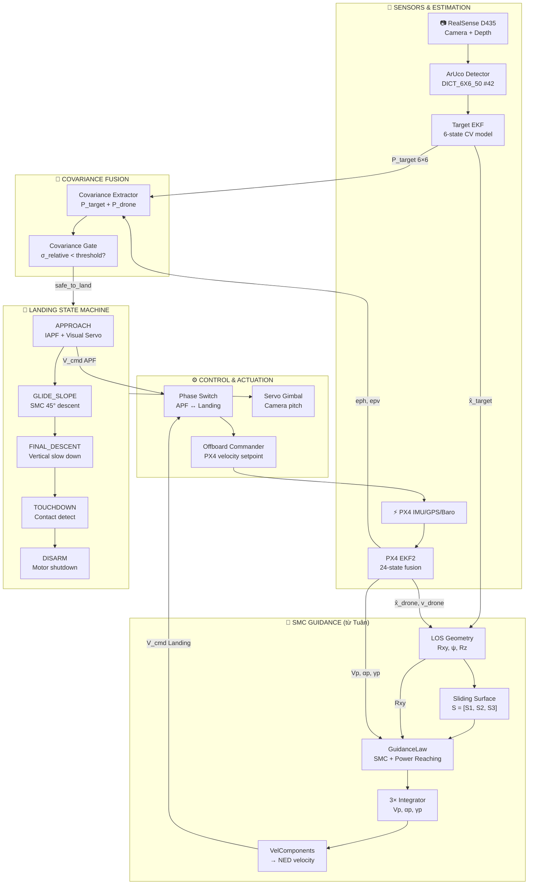
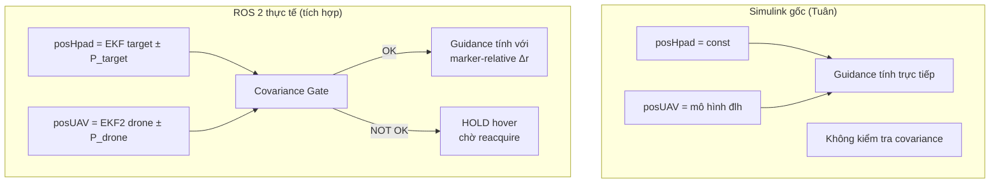
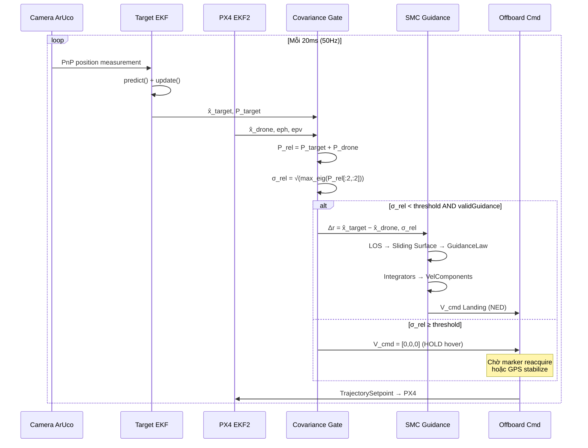
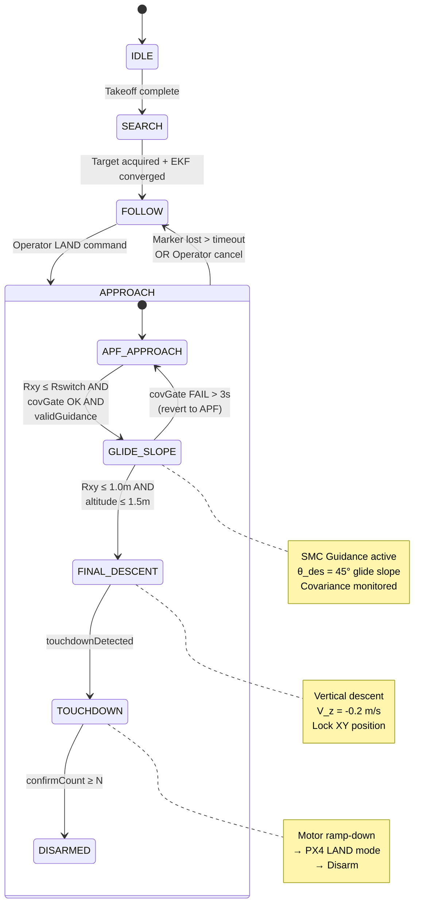
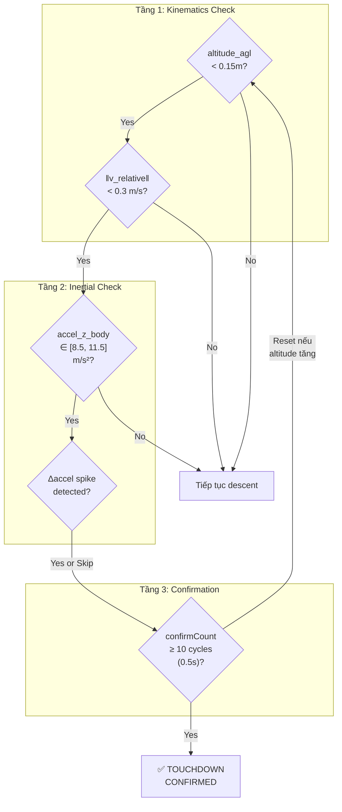
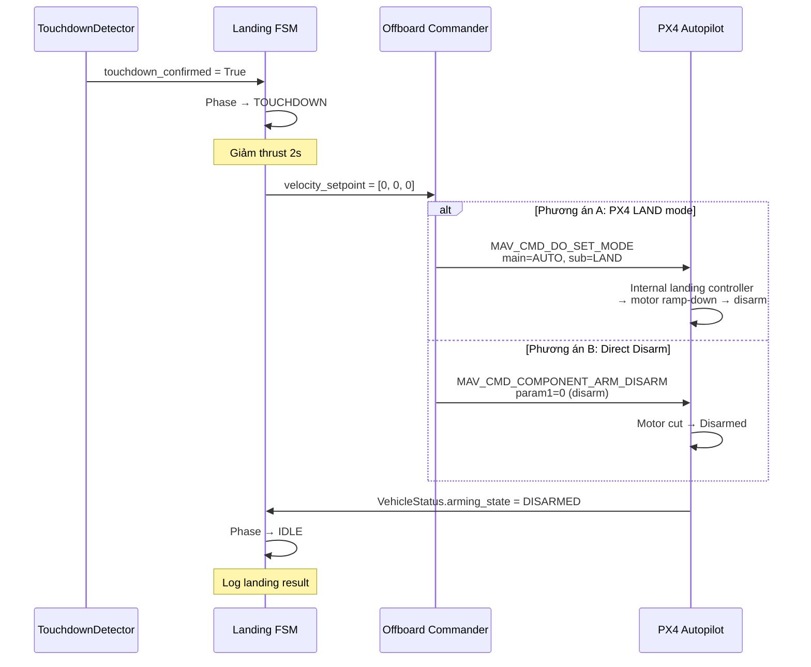
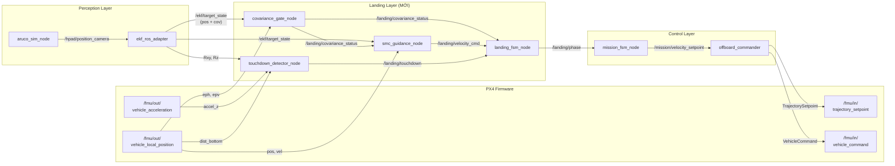

# 🛬 Kế hoạch tích hợp Precision Landing — Covariance-Aware SMC Guidance

> **Dự án**: VDT Quadrotor Autonomous Landing on ArUco H-Pad  
> **Ngày lập**: 05/10/2026  
> **Tác giả**: Duy (Vision/Estimation Lead)  
> **Cơ sở thuật toán**: Terminal-Angle-Constrained Sliding Mode Guidance (Tuân)  
> **Scope**: Tích hợp Covariance từ cả Target EKF + PX4 EKF2 vào pipeline Landing + Touchdown Detection

---

## Mục lục

1. [Tổng quan vấn đề & Mục tiêu](#1-tổng-quan-vấn-đề--mục-tiêu)
2. [Kiến trúc tổng thể hệ thống Landing](#2-kiến-trúc-tổng-thể-hệ-thống-landing)
3. [Mô hình sai số tương đối kép (Dual-EKF Covariance)](#3-mô-hình-sai-số-tương-đối-kép-dual-ekf-covariance)
4. [Tích hợp Covariance vào SMC Guidance](#4-tích-hợp-covariance-vào-smc-guidance)
5. [Máy trạng thái Landing 5 pha](#5-máy-trạng-thái-landing-5-pha)
6. [Touchdown Detection & Motor Shutdown](#6-touchdown-detection--motor-shutdown)
7. [Giao diện ROS 2 Topics & Messages](#7-giao-diện-ros-2-topics--messages)
8. [Mapping Module → File code](#8-mapping-module--file-code)
9. [Roadmap triển khai theo Sprint](#9-roadmap-triển-khai-theo-sprint)
10. [Phụ lục — Tham số khuyến nghị](#10-phụ-lục--tham-số-khuyến-nghị)

---

## 1. Tổng quan vấn đề & Mục tiêu

### 1.1. Bản chất vấn đề sai số kép

Hệ thống drone sử dụng **hai bộ EKF độc lập** để ước lượng vị trí:

| Đối tượng | Bộ lọc | State Vector | Nguồn đo | Covariance Output |
|---|---|---|---|---|
| **Drone** | PX4 EKF2 (firmware) | `[x,y,z, vx,vy,vz, ...]` 24 states | IMU + GPS + Baro + Mag | `eph`, `epv` trong `VehicleLocalPosition` |
| **H-Pad** | TargetStateEKF (code mình) | `[x,y,z, vx,vy,vz]` 6 states | ArUco PnP qua camera | Ma trận `P` 6×6 trong `/ekf/target_state` |

Khi thuật toán landing tính sai lệch vị trí `Δr = r̂_pad − r̂_drone`, sai số thực tế là **tổ hợp** của cả hai nguồn ước lượng:

```
                    ┌──────────────────────────────────────────────┐
                    │    Vị trí thực drone    Vị trí thực H-Pad    │
                    │         ●                      ●             │
                    │        ╱                        ╲            │
                    │   σ_drone                   σ_target         │
                    │      ╱                          ╲           │
                    │  x̂_drone ─── Δr ước lượng ─── x̂_target     │
                    │                                              │
                    │  σ_relative = √(σ²_drone + σ²_target)       │
                    └──────────────────────────────────────────────┘
```

> [!CAUTION]
> Nếu `σ_relative > bán kính bãi đáp / 2`, drone có thể "nghĩ" mình đã align nhưng thực tế nằm ngoài H-Pad!

### 1.2. Mục tiêu thiết kế

| # | Mục tiêu | Tiêu chí đánh giá |
|---|---|---|
| 1 | Hạ cánh mềm trên H-Pad **đứng yên** | Sai lệch tiếp đất < 10cm, vận tốc chạm < 0.3 m/s |
| 2 | Camera **luôn giữ marker** trong FOV suốt quá trình landing | Góc tiếp cận 45° đảm bảo ArUco luôn nằm trong khung hình |
| 3 | **Không cho phép landing** khi covariance quá lớn | Tự động hold/abort nếu σ_relative > ngưỡng an toàn |
| 4 | Phát hiện chạm đất **đáng tin cậy** với phần cứng hiện có | Kết hợp ≥2 tín hiệu: altitude + gia tốc + marker size |
| 5 | Tương thích firmware PX4 hiện tại | Sử dụng Offboard velocity mode, LAND/Disarm qua MAVLink |

---

## 2. Kiến trúc tổng thể hệ thống Landing

### 2.1. Sơ đồ kiến trúc module



### 2.2. Phần cứng hệ thống hiện tại

| Thành phần | Model | Vai trò trong Landing |
|---|---|---|
| Flight Controller | Pixhawk 6C (PX4 v1.14+) | EKF2 fusion, Offboard mode, Arm/Disarm |
| Camera | Intel RealSense D435 | ArUco detection + Depth sensing |
| Companion Computer | Jetson Nano / NUC | ROS 2 nodes, EKF, Guidance |
| Servo Gimbal | 2-axis (pitch + yaw) | Camera pointing control (IBVS) |
| ArUco Marker | **Nested Dual-Scale Board**<br/>• Outer: ID 42, 20cm (dải xa 0.8–5m)<br/>• Inner: ID 43, 4cm (dải gần 0.05–0.8m) | Landing pad identifier với khả năng bám liên tục cự ly gần |
| H-Pad | ~40cm × 40cm | Landing surface chứa nested board đồng tâm |
| Frame | Holybro X500 Depth | Quadrotor platform |

---

## 3. Mô hình toán học sai số tương đối và cơ chế Covariance Gating

### 3.1. Mô hình không gian trạng thái và hiệp phương sai ước lượng bãi đáp ($P_{target\_pos}$)

Trạng thái động học của bãi đáp được mô tả bởi vector trạng thái 6 chiều:
$$\mathbf{x}_T = [\mathbf{p}_T^T, \mathbf{v}_T^T]^T \in \mathbb{R}^6, \quad \text{với } \mathbf{p}_T = [x_T, y_T, z_T]^T, \; \mathbf{v}_T = [\dot{x}_T, \dot{y}_T, \dot{z}_T]^T$$

Bộ lọc Kalman mở rộng (EKF) duy trì ma trận hiệp phương sai sai số trạng thái $\mathbf{P}_T \in \mathbb{R}^{6 \times 6}$:
$$\mathbf{P}_T(t) = \mathbb{E}\left[(\mathbf{x}_T(t) - \hat{\mathbf{x}}_T(t))(\mathbf{x}_T(t) - \hat{\mathbf{x}}_T(t))^T\right]$$

Chu trình đệ quy EKF:
- **Pha dự báo (Time Update):**
  $$\hat{\mathbf{x}}_T^-(k) = \mathbf{F} \hat{\mathbf{x}}_T(k-1), \quad \mathbf{P}_T^-(k) = \mathbf{F} \mathbf{P}_T(k-1) \mathbf{F}^T + \mathbf{Q}(\Delta t)$$
- **Pha cập nhật đo lường (Measurement Update):**
  $$\mathbf{K}_k = \mathbf{P}_T^-(k) \mathbf{H}^T \left(\mathbf{H} \mathbf{P}_T^-(k) \mathbf{H}^T + \mathbf{R}_k\right)^{-1}$$
  $$\mathbf{P}_T(k) = (\mathbf{I} - \mathbf{K}_k \mathbf{H}) \mathbf{P}_T^-(k) (\mathbf{I} - \mathbf{K}_k \mathbf{H})^T + \mathbf{K}_k \mathbf{R}_k \mathbf{K}_k^T$$

Khối con hiệp phương sai vị trí 3D $\mathbf{P}_{target\_pos} \in \mathbb{R}^{3 \times 3}$ được trích xuất trực tiếp:
$$\mathbf{P}_{target\_pos} = \mathbf{P}_T[0:3, 0:3] = \begin{bmatrix} \sigma_{tx}^2 & \sigma_{txy} & \sigma_{txz} \\ \sigma_{txy} & \sigma_{ty}^2 & \sigma_{tyz} \\ \sigma_{txz} & \sigma_{tyz} & \sigma_{tz}^2 \end{bmatrix}$$

- **Giao diện dữ liệu:** Trích xuất qua ROS 2 topic `/ekf/target_state` (`nav_msgs/msg/Odometry`), đọc trường `msg.pose.covariance[0..35]`:
  $$\sigma_{tx}^2 = \text{cov}[0], \quad \sigma_{txy} = \text{cov}[1], \quad \sigma_{ty}^2 = \text{cov}[7], \quad \sigma_{tz}^2 = \text{cov}[14]$$

### 3.2. Mô hình hiệp phương sai ước lượng trạng thái Drone ($\mathbf{P}_{drone\_pos}$)

Vị trí drone $\mathbf{p}_D = [x_D, y_D, z_D]^T$ trong hệ quy chiếu cục bộ NED được ước lượng bởi PX4 EKF2 (24-state estimation). Sai số vị trí 1-sigma được PX4 cung cấp qua topic `/fmu/out/vehicle_local_position`:
- $eph = \sigma_h = \sqrt{\sigma_N^2 + \sigma_E^2}$: Độ lệch chuẩn vị trí theo phương ngang (Horizontal Position Error Metric, đơn vị: mét).
- $epv = \sigma_v = \sigma_D$: Độ lệch chuẩn vị trí theo phương thẳng đứng (Vertical Position Error Metric, đơn vị: mét).

Mô hình ma trận hiệp phương sai vị trí drone được thiết lập theo giả định phân bố đẳng hướng trên mặt phẳng ngang (Isotropic horizontal error model):
$$\mathbf{P}_{drone\_pos} = \begin{bmatrix} eph^2 & 0 & 0 \\ 0 & eph^2 & 0 \\ 0 & 0 & epv^2 \end{bmatrix} \in \mathbb{R}^{3 \times 3}$$

- **Đặc tính động học:** $eph$ và $epv$ biến thiên thời gian phụ thuộc vào chất lượng thu tín hiệu GNSS/RTK, độ rung cảm biến IMU và động lực học bay:
  - Điều kiện RTK Fix / Visual Odometry: $eph \in [0.03, 0.10]\text{ m}$.
  - Điều kiện GNSS tiêu chuẩn ngoài trời: $eph \in [0.30, 0.80]\text{ m}$.
  - Môi trường GNSS suy biến / Multipath: $eph \in [1.00, 2.50]\text{ m}$.

### 3.3. Mô hình hiệp phương sai tương đối toàn cục (Global Relative Covariance)

Vector sai lệch vị trí tương đối giữa tâm bãi đáp và trọng tâm drone:
$$\Delta \mathbf{r} = \hat{\mathbf{p}}_T - \hat{\mathbf{p}}_D = [\Delta x, \Delta y, \Delta z]^T$$

Do bộ lọc Target EKF và bộ lọc PX4 EKF2 hoạt động độc lập (hai quá trình ngẫu nhiên không tương quan, $\mathbb{E}[(\mathbf{x}_T - \hat{\mathbf{x}}_T)(\mathbf{x}_D - \hat{\mathbf{x}}_D)^T] = \mathbf{0}$):
$$\mathbf{P}_{relative} = \mathbf{P}_{target\_pos} + \mathbf{P}_{drone\_pos} \in \mathbb{R}^{3 \times 3}$$

$$\mathbf{P}_{relative} = \begin{bmatrix} 
\sigma_{tx}^2 + eph^2 & \sigma_{txy} & \sigma_{txz} \\ 
\sigma_{txy} & \sigma_{ty}^2 + eph^2 & \sigma_{tyz} \\ 
\sigma_{txz} & \sigma_{tyz} & \sigma_{tz}^2 + epv^2 
\end{bmatrix}$$

Chiếu ma trận hiệp phương sai lên mặt phẳng ngang tiếp xúc $(x, y)$:
$$\mathbf{P}_{xy} = \mathbf{P}_{relative}[0:2, 0:2] = \begin{bmatrix} \sigma_{tx}^2 + eph^2 & \sigma_{txy} \\ \sigma_{txy} & \sigma_{ty}^2 + eph^2 \end{bmatrix}$$

Phân rã phổ (Spectral Decomposition): $\mathbf{P}_{xy} = \mathbf{V} \mathbf{\Lambda} \mathbf{V}^T$ với $\mathbf{\Lambda} = \text{diag}(\lambda_1, \lambda_2)$. Giá trị riêng cực đại:
$$\lambda_{max} = \max(\lambda_1, \lambda_2) = \frac{\text{tr}(\mathbf{P}_{xy}) + \sqrt{(\text{tr}(\mathbf{P}_{xy}))^2 - 4\det(\mathbf{P}_{xy})}}{2}$$

- **Độ lệch chuẩn theo phương bất lợi nhất (Worst-Case Directional Uncertainty):**
  $$\sigma_{relative\_xy} = \sqrt{\lambda_{max}(\mathbf{P}_{xy})}$$
- **Bán kính tin cậy 3-sigma ($99.7\%$ Confidence Ellipse):**
  $$R_{conf\_3\sigma} = 3 \cdot \sigma_{relative\_xy} = 3 \sqrt{\lambda_{max}(\mathbf{P}_{xy})}$$

### 3.4. Chuẩn an toàn hạ cánh: Cơ chế Covariance Gating

Để đảm bảo toàn bộ diện tích tiếp xúc của khung chân drone (Landing Gear Footprint) nằm trọn trong mặt phẳng bãi đáp khi tiếp đất:

1. **Ràng buộc biên hình học (Geometric Boundary):**
   Gọi $R_{pad}$ là bán kính hữu ích của bãi đáp ($R_{pad} = D_{pad}/2$), $r_{gear}$ là bán kính giới hạn của khung chân tiếp xúc drone, và $\mathbf{e}_{track} = \|\Delta \hat{\mathbf{r}}_{xy}\|$ là sai số bám điều khiển.
   Khoảng cách cực đại từ tâm bãi đáp đến điểm xa nhất của chân tiếp xúc với độ tin cậy $99.7\%$ là:
   $$r_{max\_contact} = \|\Delta \hat{\mathbf{r}}_{xy}\| + R_{conf\_3\sigma} + r_{gear}$$

2. **Điều kiện an toàn hạ cánh (Covariance Gate Formulation):**
   Hệ thống cho phép tiếp tục hạ cánh khi và chỉ khi:
   $$r_{max\_contact} \le R_{pad} \iff \|\Delta \hat{\mathbf{r}}_{xy}\| + 3\sqrt{\lambda_{max}(\mathbf{P}_{xy})} \le R_{pad} - r_{gear}$$

3. **Chuẩn hóa hệ số an toàn cho thiết kế:**
   Với cấu hình drone kích thước $r_{gear} \approx R_{pad}/2$, không gian dung sai cho phép co về:
   $$\boxed{\|\Delta \hat{\mathbf{r}}_{xy}\| + 3\sqrt{\lambda_{max}(\mathbf{P}_{xy})} \le \frac{R_{pad}}{2}}$$
   - **Quy tắc quyết định:**
     $$\text{Landing\_Authorization} = \begin{cases} 
     \text{TRUE (Tiến hành hạ cánh)} & \text{khi } \|\Delta \hat{\mathbf{r}}_{xy}\| + 3\sqrt{\lambda_{max}(\mathbf{P}_{xy})} \le \frac{R_{pad}}{2} \\
     \text{FALSE (Duy trì Hover / Abort)} & \text{khi } \|\Delta \hat{\mathbf{r}}_{xy}\| + 3\sqrt{\lambda_{max}(\mathbf{P}_{xy})} > \frac{R_{pad}}{2}
     \end{cases}$$

### 3.5. Chuyển đổi hệ quy chiếu cục bộ Marker-Relative (Triệt tiêu sai số GPS)

Trong điều kiện bay ngoài trời sử dụng GPS dân sự thông thường, $eph \approx 0.5 - 1.5\text{ m} > R_{pad}$, khiến điều kiện kiểm tra toàn cầu không thể thỏa mãn. Để giải quyết triệt để vấn đề này, hệ thống áp dụng cơ chế chuyển hệ quy chiếu **Marker-Relative**:

1. **Thiết lập hệ tọa độ gốc bãi đáp (Marker Frame):**
   Gán tâm bãi đáp làm gốc quy chiếu cục bộ $\mathcal{F}_{pad}$: $\mathbf{p}_{origin} \equiv [0, 0, 0]^T$.

2. **Đo lường trực tiếp qua PnP:**
   Camera đo trực tiếp vector tịnh tiến và ma trận quay từ quang tâm camera tới marker:
   $$\mathbf{t}_c \in \mathbb{R}^3, \quad \mathbf{R}_c \in SO(3)$$

3. **Chuyển đổi hình học về hệ tọa độ ngang phẳng (Horizontal Relative Vector):**
   Chiếu vector đo qua ma trận góc quay Gimbal $\mathbf{R}_g$ và ma trận quay tư thế thân drone $\mathbf{R}_b^n(\phi, \theta)$ (Body-to-NED rotation matrix) trích xuất từ IMU high-rate ($>250\text{ Hz}$, sai số góc $< 0.5^\circ$):
   $$\mathbf{r}_{rel} = \mathbf{R}_b^n \cdot \mathbf{R}_g \cdot \mathbf{t}_c = [\Delta x_{MR}, \Delta y_{MR}, \Delta z_{MR}]^T$$

4. **Hiệp phương sai Marker-Relative:**
   Vector tương đối $\mathbf{r}_{rel}$ hoàn toàn độc lập với vị trí toàn cầu $\mathbf{p}_D$ và sai số $eph$ của PX4. Ma trận hiệp phương sai trong hệ quy chiếu Marker-Relative chỉ phụ thuộc vào sai số đo của camera PnP:
   $$\mathbf{P}_{relative}^{MR} = \mathbf{J}_{TF} \cdot \mathbf{R}_{vision} \cdot \mathbf{J}_{TF}^T \ll \mathbf{P}_{relative}^{Global}$$
   Với $\sigma_{relative}^{MR} \approx 0.01 - 0.03\text{ m}$, điều kiện an toàn hạ cánh hoàn toàn được thỏa mãn ở cự ly tiếp cận.

### 3.6. Cấu hình Nested Dual-Scale ArUco Board và Tính liên tục của PnP

Để mở rộng dải độ cao hoạt động từ $5.0\text{ m}$ xuống tới $0.05\text{ m}$ mà không gây suy biến nghiệm PnP do hiện tượng cắt biên ảnh (Edge Clipping), bãi đáp được thiết kế dạng **Nested ArUco Board**:

1. **Mô hình hình học bãi đáp:**
   - **Outer Marker:** ID 42, kích thước $L_{outer} = 20\text{ cm}$, vùng hoạt động $z \in [0.8\text{m}, 5.0\text{m}]$.
   - **Inner Marker:** ID 43, kích thước $L_{inner} = 4\text{ cm}$, đồng tâm với ID 42, vùng hoạt động $z \in [0.05\text{m}, 0.8\text{m}]$.

2. **Mô hình toán học ArUco Board:**
   Tập hợp 8 đỉnh 3D của hai marker được định nghĩa trên cùng mặt phẳng $Z=0$ với gốc tọa độ đặt tại tâm bãi đáp:
   $$\mathcal{M} = \{\mathbf{P}_i^{(outer)}\}_{i=1}^4 \cup \{\mathbf{P}_j^{(inner)}\}_{j=1}^4, \quad \mathbf{P} \in \mathbb{R}^3$$

3. **Hàm tối ưu hóa đa điểm (Multi-point PnP Optimization):**
   Nghiệm tư thế $(\mathbf{R}^*, \mathbf{t}^*)$ được xác định qua bài toán phi tuyến:
   $$(\mathbf{R}^*, \mathbf{t}^*) = \arg\min_{\mathbf{R}, \mathbf{t}} \sum_{k \in \mathcal{V}} \left\| \mathbf{u}_k - \pi(\mathbf{K}, \mathbf{R} \mathbf{P}_k + \mathbf{t}) \right\|^2$$
   Trong đó:
   - $\mathcal{V}$ là tập hợp các điểm góc quan sát được trong khung hình ảnh.
   - $\mathbf{u}_k \in \mathbb{R}^2$ là tọa độ pixel của góc $k$.
   - $\pi(\cdot)$ là hàm chiếu phối cảnh ma trận nội suy camera $\mathbf{K}$.

4. **Tính chất liên tục và chống nhảy bước (Continuous Transition):**
   Do cả hai marker cùng quy chiếu về gốc tọa độ tâm $(0,0,0)$, vector nghiệm $\mathbf{t}^*(z)$ đạt tính chất liên tục $C^0$ trên toàn bộ dải độ cao chuyển tiếp $z \in [0.4\text{m}, 0.8\text{m}]$. Hệ thống không xuất hiện hiện tượng gián đoạn tín hiệu điều khiển khi chuyển vùng quan sát giữa marker lớn và marker nhỏ.

---

## 4. Tích hợp Covariance vào SMC Guidance

### 4.1. Sửa đổi thuật toán Tuân cho hệ thống ROS 2

Thuật toán gốc của Tuân trong Simulink sử dụng vị trí pad lý tưởng (`posHpad = [-25, -25, 0]`). Khi tích hợp vào ROS 2 thực tế, cần thay đổi:



### 4.2. Covariance-Aware Rswitch (Adaptive Phase Transition)

Trong code gốc, `Rswitch = 15m` là hằng số. Với covariance awareness:

```python
def compute_adaptive_Rswitch(self, sigma_relative: float) -> float:
    """Adaptive switching distance based on current estimation quality.
    
    Idea: Chỉ bắt đầu SMC landing khi đã đủ gần VÀ ước lượng đủ tốt.
    Nếu covariance lớn, thu hẹp Rswitch để buộc drone phải tiến gần hơn
    (→ marker lớn hơn trong FOV → PnP chính xác hơn → P giảm).
    """
    R_max = 15.0   # Rswitch tối đa khi covariance rất tốt (m)
    R_min = 3.0    # Rswitch tối thiểu (m), ít nhất cần khoảng cách này
    
    # Ngưỡng covariance "lý tưởng" để dùng Rswitch tối đa
    sigma_ideal = 0.05   # σ < 5cm → tin cậy cao
    # Ngưỡng covariance "tệ" để thu hẹp Rswitch tối thiểu
    sigma_bad = 0.30     # σ > 30cm → ước lượng chưa tốt
    
    if sigma_relative <= sigma_ideal:
        return R_max
    elif sigma_relative >= sigma_bad:
        return R_min
    else:
        # Nội suy tuyến tính
        ratio = (sigma_relative - sigma_ideal) / (sigma_bad - sigma_ideal)
        return R_max - ratio * (R_max - R_min)
```

### 4.3. Covariance-Aware Sliding Surface Weight

Khi covariance cao, các hệ số mặt trượt nên "mềm" hơn (tiếp cận chậm hơn, an toàn hơn):

```python
def adaptive_gains(self, sigma_relative: float):
    """Scale SMC gains based on estimation confidence.
    
    Khi σ nhỏ → tự tin → gains lớn → tiếp cận nhanh
    Khi σ lớn → không chắc chắn → gains nhỏ → tiếp cận thận trọng
    """
    confidence = max(0.0, 1.0 - sigma_relative / 0.20)  # [0,1]
    confidence = np.clip(confidence, 0.3, 1.0)           # Không giảm quá 30%
    
    ka = 0.2 * confidence    # Tốc độ khép Rxy
    kb = 0.6 * confidence    # Tốc độ áp góc dốc
    kc = 0.4 * confidence    # Tốc độ căn chỉnh phương vị
    
    return ka, kb, kc
```

### 4.4. Sơ đồ luồng dữ liệu Covariance trong Guidance Loop



---

## 5. Máy trạng thái Landing 5 pha

### 5.1. Tổng quan FSM

Mở rộng FSM hiện tại từ `IDLE → SEARCH → FOLLOW → APPROACH → LAND` thành hệ thống landing chi tiết hơn trong pha APPROACH → LAND:



### 5.2. Chi tiết từng pha

#### Pha 1: APF_APPROACH (IAPF tiến gần H-Pad)

**Mục đích**: Sử dụng IAPF Planner hiện có để đưa drone tiến gần H-Pad từ vị trí Follow (3.5m follow distance).

**Điều kiện vào**: Operator bấm LAND command.

**Hành vi**:
- IAPF Planner tạo velocity command tiến về phía target
- IBVS giữ camera hướng vào marker (servo gimbal pitch)
- Target EKF chạy liên tục, P_target giảm khi liên tục nhìn thấy marker
- **Covariance Gate chạy ngầm** để kiểm tra readiness cho SMC

**Điều kiện chuyển → GLIDE_SLOPE**:
```python
can_enter_glide = (
    Rxy <= Rswitch_adaptive              # Đủ gần (3–15m tùy σ)
    and sigma_relative < sigma_max_glide  # σ < 0.10m (adjustable)
    and valid_guidance                     # SMC có nghiệm hợp lệ
    and Vp_actual > 0.1                   # Drone đang bay (không hover chết)
    and abs(cos(gamma_actual)) > 0.1      # Không cắm đầu
    and marker_visible                     # ArUco đang detect
)
```

#### Pha 2: GLIDE_SLOPE (SMC Descent theo góc 45°)

**Mục đích**: Hạ cánh theo quỹ đạo cong mượt, giữ marker trong FOV camera.

**Hành vi**:
- LandingModeManager chốt initial state từ trạng thái thực tại thời điểm chuyển pha
- GuidanceLaw tính `[dVp, dα, dγ]` mỗi cycle
- 3 Integrators tạo reference velocity
- VelComponents đổi sang NED → gửi Offboard Commander
- **Gimbal servo**: chuyển sang chế độ nhìn xuống chéo (pitch tùy theo γ_p)

**Covariance monitoring trong pha này**:
```python
# Mỗi cycle kiểm tra:
if sigma_relative > sigma_abort_glide:  # Ví dụ: σ > 0.15m
    abort_timer += dt
    if abort_timer > 3.0:  # Cho phép 3s mất marker trước khi abort
        revert_to_APF_APPROACH()
        abort_timer = 0
else:
    abort_timer = 0  # Reset nếu σ trở lại OK
```

**Adaptive gains**: `ka, kb, kc` điều chỉnh theo σ_relative realtime (xem mục 4.3).

**Điều kiện chuyển → FINAL_DESCENT**:
```python
can_enter_final = (
    Rxy <= 1.0               # Sát bên trên pad (ngang)
    and abs(Rz) <= 1.5       # Độ cao tương đối < 1.5m
    and sigma_relative < 0.06 # σ < 6cm (rất tin cậy ở gần)
)
```

#### Pha 3: FINAL_DESCENT (Hạ thẳng đứng chậm)

**Mục đích**: Từ ~1.5m trên pad, hạ thẳng đứng với vận tốc rất chậm.

**Hành vi**:
- **Lock vị trí XY** trên đỉnh pad (PID position hold hoặc marker-relative XY correction)
- **Vận tốc hạ**: `Vz = -0.2 m/s` (giảm từ từ về -0.15 m/s khi Rz < 0.5m)
- Camera gimbal nhìn thẳng xuống (pitch = -90°) để theo dõi marker ở gần
- **Theo dõi marker size**: khi marker chiếm >50% FOV → chuyển dùng inner marker (nếu có)

**Covariance gate**:
```python
if sigma_relative > 0.10:  # Mất marker hoặc noise
    Vz = 0.0  # DỪNG hạ, hover tại chỗ
    # Chờ marker reacquire
```

**Điều kiện chuyển → TOUCHDOWN**:
```python
touchdown_detected = touchdown_detector.check(
    altitude_agl=altitude_agl,
    accel_z=accel_z_body,
    marker_size_px=marker_size_px,
    Rxy=Rxy, Rz=Rz,
    vel_relative=vel_relative
)
```

#### Pha 4: TOUCHDOWN (Phát hiện chạm đất)

**Chi tiết cơ chế**: Xem [Mục 6](#6-touchdown-detection--motor-shutdown).

#### Pha 5: DISARMED (Ngắt động cơ)

**Hành vi**:
1. Gửi lệnh `MAV_CMD_NAV_LAND` (hoặc `MAV_CMD_COMPONENT_ARM_DISARM` param1=0)
2. Chờ PX4 xác nhận `VehicleStatus.arming_state == DISARMED`
3. Chuyển FSM về IDLE
4. Log kết quả landing (sai lệch cuối cùng, vận tốc chạm, thời gian landing)

---

## 6. Touchdown Detection & Motor Shutdown

### 6.1. Thách thức phát hiện chạm đất

| Thách thức | Giải thích |
|---|---|
| Không có landing gear sensor | Drone X500 không có contact switch |
| Barometer drift | Áp suất thay đổi theo gió cánh quạt (ground effect) |
| GPS altitude noise | ±1–3m, vô dụng cho touchdown detection |
| PnP breakdown ở gần | **Đã giải quyết bằng Inner Marker (ID 43)**: Cho phép PnP tin cậy xuống tới 5cm |
| Nảy pad (bounce) | Drone có thể chạm rồi nảy lên, cần confirm đa tầng |

### 6.2. Chiến lược Touchdown Detection 3 tầng



### 6.3. Chi tiết từng tầng detection

#### Tầng 1 — Kinematics (Vị trí & Vận tốc)

```python
class TouchdownDetector:
    def __init__(self):
        self.confirm_count = 0
        self.confirm_threshold = 10     # 10 cycles × 50ms = 0.5s
        self.alt_threshold = 0.15       # m (AGL)
        self.vel_threshold = 0.3        # m/s (relative)
        self.accel_z_min = 8.5          # m/s² (≈ 1g - margin)
        self.accel_z_max = 11.5         # m/s² (≈ 1g + margin)
        self.jerk_threshold = 5.0       # m/s³ (spike khi chạm)
        self.prev_accel_z = 9.81
        
    def check(self, altitude_agl, vel_relative, accel_z_body, dt):
        """Multi-layer touchdown detection.
        
        Args:
            altitude_agl: Altitude above ground level (m), from:
                          - Depth camera pointing down, OR
                          - Rz from target EKF (posUAV_z - posHpad_z)
            vel_relative: 3D velocity relative to pad (m/s)
            accel_z_body: Body-frame Z acceleration (m/s²)
                          from /fmu/out/vehicle_acceleration
            dt: Time step (s)
        """
        speed = np.linalg.norm(vel_relative)
```

**Nguồn `altitude_agl`** (theo thứ tự ưu tiên):
1. **RealSense Depth camera** nhìn xuống: đo trực tiếp khoảng cách tới mặt đất, rất chính xác ở <2m
2. **Rz từ SMC** (posUAV_z − posHpad_z): tin cậy khi marker còn visible
3. **PX4 distance sensor** (nếu có rangefinder): `VehicleLocalPosition.dist_bottom`

#### Tầng 2 — Inertial (Gia tốc body)

Khi drone chạm mặt pad, gia tốc body-frame thay đổi đặc trưng:

```
            Đang bay (hover)          Vừa chạm pad
            ──────────────          ──────────────
  accel_z   ≈ 9.81 m/s²            spike → ≈ 12-15 m/s²
            (bù trọng lực           (phản lực mặt đất
             bằng lực đẩy)            cộng thêm)
                                    
            Sau đó ổn định → ≈ 9.81 m/s² (trọng lực thuần túy,
                                           motor tắt/giảm)
```

```python
        # Tầng 2: Inertial check
        jerk = abs(accel_z_body - self.prev_accel_z) / dt
        self.prev_accel_z = accel_z_body
        
        accel_near_1g = (self.accel_z_min <= accel_z_body <= self.accel_z_max)
        jerk_spike = jerk > self.jerk_threshold
```

**Cách lấy `accel_z_body` từ PX4:**
```python
# Topic: /fmu/out/vehicle_acceleration (px4_msgs/VehicleAcceleration)
# Hoặc: /fmu/out/sensor_combined (SensorCombined.accelerometer_m_s2[2])
def accel_cb(self, msg):
    # msg.xyz[2] là accel theo trục Z body (hướng xuống ở NED)
    self.accel_z_body = msg.xyz[2]  # m/s²
```

#### Tầng 3 — Temporal Confirmation (Chống nảy)

```python
        # Tầng 3: Confirmation with hysteresis
        kinematics_ok = (altitude_agl < self.alt_threshold 
                         and speed < self.vel_threshold)
        inertial_ok = accel_near_1g  # or jerk_spike cho detect nhanh hơn
        
        if kinematics_ok and inertial_ok:
            self.confirm_count += 1
        elif altitude_agl > self.alt_threshold * 1.5:
            # Nếu nảy lên → reset hoàn toàn
            self.confirm_count = 0
        else:
            # Giảm dần (không reset ngay) để chống flicker
            self.confirm_count = max(0, self.confirm_count - 1)
        
        return self.confirm_count >= self.confirm_threshold
```

### 6.4. Quy trình Motor Shutdown

Sau khi Touchdown được xác nhận, cần **dừng motor an toàn** theo đúng quy trình PX4:



> [!WARNING]
> **Khuyến nghị dùng Phương án A (PX4 LAND mode)** thay vì Direct Disarm. Lý do:
> - PX4 LAND mode có motor ramp-down nội bộ (giảm thrust từ từ)
> - Direct Disarm cắt motor đột ngột → drone rơi từ 10–15cm → có thể nảy hoặc lật
> - LAND mode cũng handle được trường hợp drone chưa thực sự chạm đất

**Lệnh MAVLink cụ thể:**

```python
# Phương án A: Chuyển sang LAND mode
def switch_to_land_mode(self):
    """Switch PX4 to AUTO.LAND mode for safe motor shutdown."""
    if HAS_PX4_MSGS:
        cmd = VehicleCommand()
        cmd.command = 176  # MAV_CMD_DO_SET_MODE
        cmd.param1 = 1.0   # MAV_MODE_FLAG_CUSTOM_MODE_ENABLED
        cmd.param2 = 4.0   # PX4_CUSTOM_MAIN_MODE_AUTO
        cmd.param3 = 6.0   # PX4_CUSTOM_SUB_MODE_AUTO_LAND
        cmd.target_system = 1
        cmd.target_component = 1
        cmd.source_system = 1
        cmd.source_component = 1
        cmd.from_external = True
        self.command_pub.publish(cmd)
    elif self.mav_conn:
        self.mav_conn.set_mode_apm(216)  # AUTO.LAND
```

### 6.5. Gimbal Servo trong quá trình Landing

| Pha Landing | Gimbal Pitch | Lý do |
|---|---|---|
| APF_APPROACH | IBVS control (−10° → −45°) | Theo dõi marker từ xa, IBVS giữ marker ở tâm ảnh |
| GLIDE_SLOPE | −45° → −70° (theo γ_p) | Camera nhìn chéo xuống theo quỹ đạo SMC 45° |
| FINAL_DESCENT | −80° → −90° | Camera nhìn thẳng xuống, marker rất gần |
| TOUCHDOWN | −90° (lock) | Không di chuyển gimbal khi chạm |

```python
def compute_gimbal_pitch(self, phase, gamma_p=None):
    """Compute gimbal pitch for each landing phase."""
    if phase == 'APF_APPROACH':
        return self.ibvs_pitch  # IBVS auto-control
    elif phase == 'GLIDE_SLOPE':
        # Gimbal bù theo góc quỹ đạo bay để giữ marker trong FOV
        # gamma_p dương khi bay lên, âm khi hạ
        pitch_deg = np.degrees(gamma_p) - 90.0  # -45° flight path → -135° → clip
        return np.clip(pitch_deg, -90.0, -30.0)
    elif phase in ('FINAL_DESCENT', 'TOUCHDOWN'):
        return -90.0  # Nhìn thẳng xuống
    else:
        return -45.0  # Default
```

---

## 7. Giao diện ROS 2 Topics & Messages

### 7.1. Topics mới cần tạo

| Topic | Message Type | Publisher | Subscriber | Tần suất |
|---|---|---|---|---|
| `/landing/phase` | `std_msgs/String` | Landing FSM | Offboard Cmd, Gimbal | 20 Hz |
| `/landing/covariance_status` | `custom_msgs/CovarianceStatus` | Covariance Gate | Landing FSM, Logger | 10 Hz |
| `/landing/velocity_cmd` | `geometry_msgs/Twist` | SMC Guidance | Phase Switch → Offboard | 50 Hz |
| `/landing/touchdown` | `std_msgs/Bool` | Touchdown Detector | Landing FSM | 20 Hz |
| `/fmu/out/vehicle_acceleration` | `px4_msgs/VehicleAcceleration` | PX4 | Touchdown Detector | 50 Hz |
| `/fmu/out/vehicle_local_position` | `px4_msgs/VehicleLocalPosition` | PX4 | Covariance Extractor | 50 Hz |

### 7.2. Dữ liệu trong Covariance Status message

```python
# Proposal: custom message hoặc dùng DiagnosticStatus
# Nội dung publish mỗi cycle:
covariance_status = {
    'sigma_target_xy': float,       # σ ngang target EKF (m)
    'sigma_target_z': float,        # σ đứng target EKF (m)
    'sigma_drone_xy': float,        # eph từ PX4 (m)
    'sigma_drone_z': float,         # epv từ PX4 (m)
    'sigma_relative_xy': float,     # σ tổng hợp ngang (m)
    'sigma_relative_z': float,      # σ tổng hợp đứng (m)
    'confidence_radius_3sigma': float,  # Bán kính tin cậy 99.7% (m)
    'safe_to_land': bool,           # True nếu confidence_radius + |Δr| < pad_radius
    'Rswitch_adaptive': float,      # Ngưỡng chuyển pha adaptive (m)
}
```

### 7.3. Sơ đồ Topics tổng thể



---

## 8. Mapping Module → File code

### 8.1. Files hiện tại cần chỉnh sửa

| File | Chỉnh sửa | Mức độ |
|---|---|---|
| [mission_fsm_node.py](file:///home/duy/VDT_project/simulation/core/mission_fsm_node.py) | Thêm sub-states trong APPROACH/LAND; nhận `/landing/phase` | Lớn |
| [offboard_commander.py](file:///home/duy/VDT_project/simulation/core/offboard_commander.py) | Thêm `switch_to_land_mode()`, subscribe `VehicleAcceleration` | Trung bình |
| [ekf_ros_adapter.py](file:///home/duy/VDT_project/simulation/perception/ekf_ros_adapter.py) | Đã publish covariance — **không cần sửa** | Không |
| [mission_params.yaml](file:///home/duy/VDT_project/simulation/config/mission_params.yaml) | Thêm section `landing_guidance` và `touchdown_detector` | Nhỏ |

### 8.2. Files mới cần tạo

| File mới | Module | Mô tả |
|---|---|---|
| `simulation/guidance/smc_guidance_node.py` | SMC Guidance ROS 2 Node | Port GuidanceLaw + SlidingSurface + LOS từ MATLAB → Python, wrap trong ROS 2 node |
| `simulation/guidance/smc_core.py` | SMC Core (không ROS) | Pure-Python implementation: `SlidingSurface`, `GuidanceLaw`, `LOSGeometry`, `VelocityIntegrator` |
| `simulation/guidance/covariance_gate.py` | Covariance Gate Node | Thu thập P_target + eph/epv, tính σ_relative, publish covariance_status |
| `simulation/guidance/landing_mode_manager.py` | Landing FSM | FSM 5 pha bên trong APPROACH/LAND |
| `simulation/guidance/touchdown_detector.py` | Touchdown Detection | Multi-layer detection logic |
| `tests/test_smc_core.py` | Unit tests | Test sliding surface, guidance law với synthetic trajectories |
| `tests/test_touchdown_detector.py` | Unit tests | Test touchdown detection logic |

### 8.3. Cấu trúc thư mục đề xuất

```
simulation/
├── core/
│   ├── mission_fsm_node.py         # (sửa) Tích hợp landing sub-FSM
│   └── offboard_commander.py       # (sửa) Thêm LAND mode command
├── guidance/                       # (MỚI) — Landing Guidance Package
│   ├── __init__.py
│   ├── smc_core.py                 # Pure-Python SMC: Surface, Law, LOS, Integrator
│   ├── smc_guidance_node.py        # ROS 2 node wrap smc_core
│   ├── covariance_gate.py          # Covariance fusion & gate node
│   ├── landing_mode_manager.py     # 5-phase landing FSM
│   └── touchdown_detector.py       # Multi-layer touchdown detection
├── perception/
│   └── ekf_ros_adapter.py          # (giữ nguyên) Đã publish covariance
├── control/
│   ├── apf_planner.py              # (giữ nguyên)
│   └── ibvs_controller.py          # (giữ nguyên)
└── config/
    └── mission_params.yaml         # (sửa) Thêm landing params
```

---

## 9. Roadmap triển khai theo Sprint

### Sprint 1 (Tuần 1–2): SMC Core + Unit Tests

**Mục tiêu**: Port thuật toán Tuân từ MATLAB sang Python, validate bằng unit tests.

| Task | Chi tiết | File |
|---|---|---|
| 1.1 | Port `SlidingSurface.m` → Python class | `smc_core.py` |
| 1.2 | Port `GuidanceLaw.m` → Python class (bao gồm singularity protection) | `smc_core.py` |
| 1.3 | Port `DistUAVtoHpad.m`, `LOSRate.m`, `HoriRangeRate.m`, `VerticalDist.m` → Python | `smc_core.py` |
| 1.4 | Port `VelocityToFlightState.m`, `VelComponents.m` → Python | `smc_core.py` |
| 1.5 | Port `LandingModeManager.m` → Python (bumpless transfer logic) | `smc_core.py` |
| 1.6 | Viết unit tests: mô phỏng drone bay thẳng về pad đứng yên, kiểm tra S → 0 | `test_smc_core.py` |
| 1.7 | So sánh kết quả Python vs MATLAB trên cùng tham số trong [Parameters.m](file:///home/duy/VDT_project/References/Tuan_Simulink/Parameters.m) | `test_smc_core.py` |

> [!TIP]
> Tham số bạn Tuân đã tune: `ka=0.2, kb=0.6, kc=0.4, k1=0.1395, k2=0.1784, k3=0.0442, m=5, n=3, θ_des=π/4`. Dùng **đúng bộ tham số này** để validate trước khi thay đổi.

### Sprint 2 (Tuần 3–4): Covariance Gate + Touchdown Detector

| Task | Chi tiết | File |
|---|---|---|
| 2.1 | Tạo `covariance_gate.py` ROS 2 node: subscribe `/ekf/target_state` + `/fmu/out/vehicle_local_position` | `covariance_gate.py` |
| 2.2 | Implement tổ hợp P_relative + adaptive Rswitch + publish covariance_status | `covariance_gate.py` |
| 2.3 | Tạo `touchdown_detector.py`: 3-layer detection (kinematics + inertial + confirmation) | `touchdown_detector.py` |
| 2.4 | Unit tests cho touchdown detector: mô phỏng tín hiệu accel spike + altitude drop | `test_touchdown_detector.py` |
| 2.5 | Test covariance gate với dữ liệu log từ PX4 SITL | Script test |

### Sprint 3 (Tuần 5–6): ROS 2 Integration + SITL Testing

| Task | Chi tiết | File |
|---|---|---|
| 3.1 | Tạo `smc_guidance_node.py`: wrap smc_core trong ROS 2 node, subscribe EKF topics | `smc_guidance_node.py` |
| 3.2 | Tạo `landing_mode_manager.py`: 5-pha FSM, tích hợp covariance gate | `landing_mode_manager.py` |
| 3.3 | Sửa `mission_fsm_node.py`: delegate APPROACH/LAND sub-states cho landing_mode_manager | `mission_fsm_node.py` |
| 3.4 | Sửa `offboard_commander.py`: thêm `switch_to_land_mode()` | `offboard_commander.py` |
| 3.5 | Thêm tham số vào `mission_params.yaml` | `mission_params.yaml` |
| 3.6 | Sửa launch file: thêm guidance + covariance + touchdown nodes | `launch_simulation.py` |
| 3.7 | **Test SITL end-to-end**: PX4 Gazebo + ArUco pad đứng yên + landing pipeline | Terminal |

### Sprint 4 (Tuần 7–8): Tuning & Edge Cases

| Task | Chi tiết |
|---|---|
| 4.1 | Tune tham số SMC (ka, kb, kc, k1–k3) trên SITL cho vận tốc chạm < 0.3 m/s |
| 4.2 | Test kịch bản mất marker giữa chừng → abort → reacquire → resume landing |
| 4.3 | Test kịch bản GPS drift lớn (eph > 1m) → covariance gate block landing |
| 4.4 | Test touchdown detector với ground effect (nảy pad, gió cánh quạt) |
| 4.5 | Ghi video demo + đo sai lệch landing (chụp ảnh vị trí chạm vs tâm pad) |
| 4.6 | Viết tài liệu vận hành + safety checklist cho bay thực |

---

## 10. Phụ lục — Tham số khuyến nghị

### 10.1. Tham số SMC Guidance (từ Tuân, giữ nguyên cho validation)

```yaml
landing_guidance:
  ros__parameters:
    # SMC Sliding Surface gains
    ka: 0.2          # Tốc độ khép Rxy (s⁻¹)
    kb: 0.6          # Tốc độ áp góc dốc (s⁻¹)
    kc: 0.4          # Tốc độ căn chỉnh phương vị (s⁻¹)
    
    # SMC Power reaching law
    k1: 0.1395       # Gain mặt trượt S1
    k2: 0.1784       # Gain mặt trượt S2
    k3: 0.0442       # Gain mặt trượt S3
    m: 5             # Mẫu số lũy thừa (odd, positive)
    n: 3             # Tử số lũy thừa (odd, 0 < n < m)
    
    # Terminal angle constraints
    theta_des: 0.7854   # π/4 = 45° góc tiếp cận đứng
    zeta_des: 0.0       # 0° góc phương vị mong muốn
    
    # Safety limits
    Rmin: 0.1           # Khoảng cách tối thiểu LOS (m)
    dVp_max: 10.0       # Giới hạn gia tốc dọc (m/s²)
    dalpha_max: 1.5708  # π/2 giới hạn tốc độ quay hướng (rad/s)
    dgamma_max: 1.5708  # π/2 giới hạn tốc độ đổi dốc (rad/s)
```

### 10.2. Tham số Covariance Gate

```yaml
covariance_gate:
  ros__parameters:
    # Ngưỡng σ cho phép chuyển pha
    sigma_max_enter_glide: 0.10    # σ_relative < 10cm mới cho vào GLIDE
    sigma_max_continue_glide: 0.15 # σ_relative < 15cm mới tiếp tục GLIDE
    sigma_max_final_descent: 0.06  # σ_relative < 6cm mới cho vào FINAL
    
    # Adaptive Rswitch
    Rswitch_max: 15.0      # m (khi σ tốt nhất)
    Rswitch_min: 3.0       # m (khi σ tệ nhất)
    sigma_ideal: 0.05      # m
    sigma_bad: 0.30        # m
    
    # Pad geometry
    pad_half_width: 0.20   # m (H-Pad 40cm → radius 20cm)
    confidence_level: 3.0  # n-sigma cho confidence ellipse
    
    # Abort timing
    abort_timeout: 3.0     # s (mất marker bao lâu thì abort GLIDE)
```

### 10.3. Tham số Touchdown Detector

```yaml
touchdown_detector:
  ros__parameters:
    alt_threshold: 0.15        # m (AGL)
    vel_threshold: 0.3         # m/s (relative speed)
    accel_z_min: 8.5           # m/s² (≈ 1g − 1.3)
    accel_z_max: 11.5          # m/s² (≈ 1g + 1.7)
    jerk_threshold: 5.0        # m/s³ (impact spike)
    confirm_cycles: 10         # × 50ms = 0.5s confirmation
    bounce_reset_factor: 1.5   # Reset nếu alt > threshold × 1.5
```

### 10.4. Tham số Final Descent

```yaml
final_descent:
  ros__parameters:
    descent_speed_initial: -0.20   # m/s (bắt đầu)
    descent_speed_final: -0.15     # m/s (gần chạm)
    descent_slow_altitude: 0.5     # m (giảm tốc ở 0.5m)
    xy_hold_kp: 2.0               # Gain giữ vị trí XY
    gimbal_pitch_final: -90.0      # độ (nhìn thẳng xuống)
```

---

> [!IMPORTANT]
> **Ưu tiên cao nhất**: Sprint 1 (port + validate SMC core) và Sprint 2 (covariance gate) có thể chạy **song song** vì hai module này độc lập. Sprint 3 mới cần kết quả của cả hai.

> [!TIP]
> **Validation nhanh**: Trước khi chạy SITL, có thể viết script Python mô phỏng offline: tạo trajectory drone bay từ xa về pad, đưa qua SMC → kiểm tra quỹ đạo có bám 45° không, vận tốc chạm có < 0.3 m/s không. Dùng `matplotlib` vẽ 3D trajectory.
