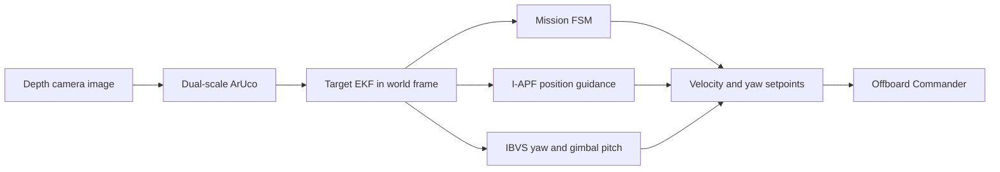

# Tracking và FOLLOW: trạng thái sau kiểm chứng

Ngày kiểm chứng: 2026-10-07
Branch: `feature/precision-landing`
Bãi đáp mô phỏng: `(3.0, 1.0, 0.02) m`; giữ nguyên cấu hình bay của drone.

## Luồng hiện tại



- Bảng marker dùng ID 42 kích thước 0,52 m để bắt từ xa và ID 43 kích thước 0,05 m cho vùng gần.
- Reacquire yêu cầu ảnh mới, marker trong ROI, EKF ở `TRACKING`, yaw đã ổn định. Khi xác nhận, FSM chuyển sang FOLLOW.
- FOLLOW kết hợp vận tốc I-APF với bù vận tốc marker. Bù chuyển động và lead goal chỉ bật sau khi EKF xác nhận vận tốc ít nhất 0,35 m/s trong 3 mẫu liên tiếp; tắt sau 4 mẫu liên tiếp dưới 0,18 m/s. Mất trạng thái `TRACKING` sẽ xóa vận tốc cũ và yêu cầu xác nhận lại.
- IBVS điều khiển yaw của thân drone và pitch của gimbal; I-APF điều khiển vận tốc ngang. FOLLOW giữ cao độ bằng Offboard altitude hold.

## Kết quả tracking/FOLLOW

### SITL với marker đứng yên

- Drone cất cánh tới khoảng 2,5 m, vào SEARCH và reacquire marker sau 0,77 s.
- FSM vào FOLLOW; không lặp lại SEARCH hoặc quay sweep trong khoảng 17 s quan sát.
- Drone ổn định gần khoảng cách bám 3,5 m. Yaw NED tiến tới khoảng 66–68° rồi giữ ổn định; sai số pixel về quanh tâm ảnh.
- Marker tiếp tục được phát hiện ở các lần báo trạng thái. Độ cao quan sát được khoảng 2,7–3,0 m.
- Lượt này không phát lệnh LAND. Marker chuyển động 0,5 m/s mới được kiểm tra bằng test logic, chưa kiểm chứng live trong Gazebo.

### Test offline

- `tests/test_tracking_control.py`, `tests/test_follow_control.py`, `tests/test_iapf_planner.py`: 39 passed.
- `tests/test_smc_guidance.py`: 10 passed.
- `py_compile` cho các module tracking/APF/SMC và `git diff --check`: thành công.

## Landing chưa được xác nhận

Lượt landing trước đã vào APPROACH/GLIDE_SLOPE và sai số ngang giảm tới khoảng 0,01 m. Chưa có touchdown. Ghi log cho thấy hai điểm cần kiểm tra tiếp:

1. Covariance 2σ đo được phần lớn khoảng 0,15–0,29 m, trong khi điều kiện vào FINAL_DESCENT hiện là `≤ 0,12 m`. FSM có thể giữ APPROACH nếu bộ lọc không giảm uncertainty thêm. Ngưỡng 0,12 m được ghi trong kế hoạch tích hợp; lượt này không tự nới ngưỡng.
2. Offboard Commander áp altitude hold khi phase khác `LAND` và lệnh `vz` gần 0. Trong APPROACH, FSM có thể phát lệnh zero khi covariance gate đóng; khi gate mở lại, SMC phát lệnh hạ. Cần kiểm tra xung đột này vì log độ cao có lúc dao động quanh 2,7–3,1 m dù đang ở GLIDE_SLOPE.

SMC hiện phát vận tốc ngang từ sai số vị trí target trong hệ world, có bù vận tốc EKF; SMC không còn dùng course tích phân làm lệnh ngang trực tiếp. Live log trước đó cho thấy lệnh đi về tâm, nhưng toàn bộ touchdown vẫn chưa được kiểm chứng.

## Topic nên xem khi chạy lại

```bash
ros2 topic echo /mission/phase
ros2 topic echo /ekf/tracking_mode
ros2 topic echo /hpad/detected
ros2 topic echo /hpad/bbox
ros2 topic echo /ekf/target_state
ros2 topic echo /apf/target_velocity_ff
ros2 topic echo /mission/velocity_setpoint
ros2 topic echo /ibvs/yaw_cmd
ros2 topic echo /landing/uncertainty_radius
ros2 topic echo /landing/sub_phase
```

Khi marker đứng yên, `/apf/target_velocity_ff` cần gần zero; khi marker chạy 0,5 m/s, feed-forward chỉ nên bật sau xác nhận motion. Nếu FOLLOW mất marker, xem timestamp bbox, `/ekf/tracking_mode`, yaw setpoint và vận tốc trước khi kiểm tra landing.

## Lệnh mô phỏng

```bash
cd /home/duy/VDT_project/PX4-Autopilot
GZ_PARTITION=vdt_harmonic PX4_GZ_WORLD=obstacle_avoidance make px4_sitl gz_x500_depth
```

```bash
source /opt/ros/humble/setup.bash
GZ_PARTITION=vdt_harmonic python3 /home/duy/VDT_project/simulation/launch/launch_simulation.py --autonomous --planner iapf
```

```bash
source /opt/ros/humble/setup.bash
python3 /home/duy/VDT_project/simulation/core/takeoff.py --alt 3.0
```

Lệnh landing là `ros2 topic pub --once /operator/land_command std_msgs/msg/Bool "{data: true}"`; chỉ chạy lại sau khi xử lý hai điểm landing ở trên.
