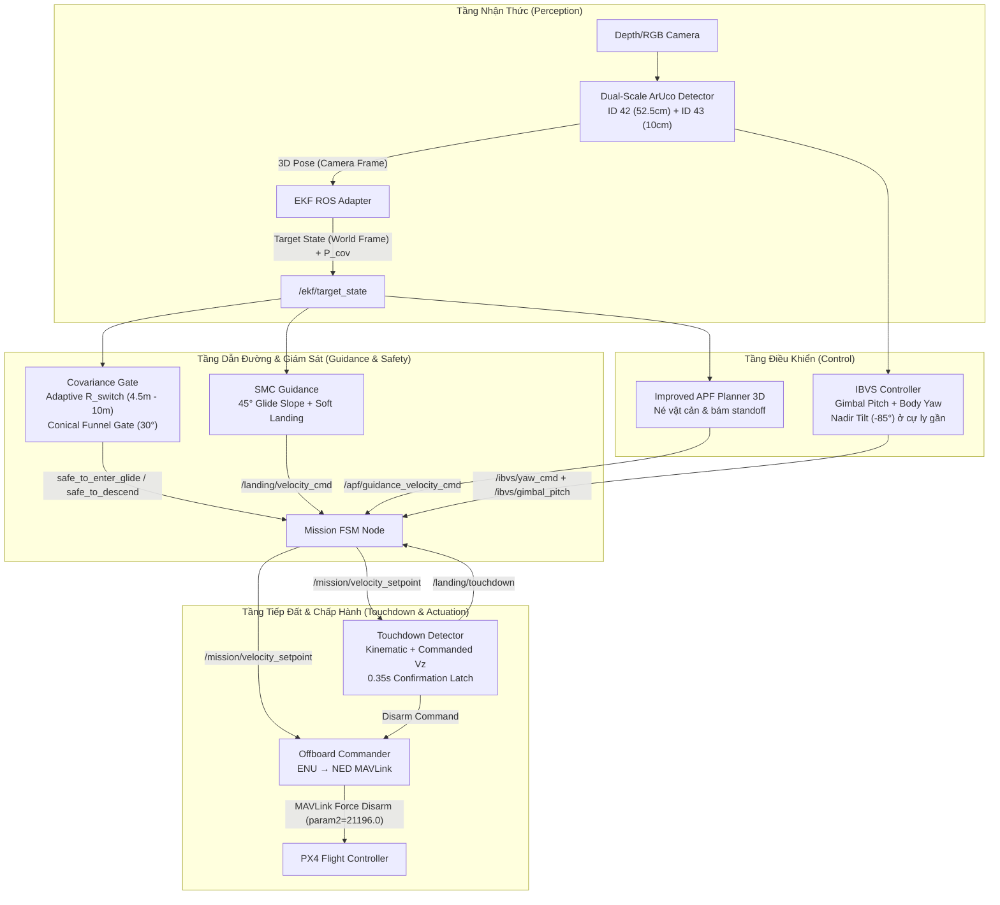

# Báo cáo Trạng thái Tracking, FOLLOW và Precision Landing

- **Ngày kiểm chứng**: 2026-10-08
- **Branch**: `feature/precision-landing`
- **Môi trường**: ROS 2 Humble · PX4 Autopilot v1.14+ SITL · Gazebo Harmonic (`obstacle_avoidance.sdf`)
- **Trạng thái**: **ĐÃ HOÀN TẤT VÀ KIỂM CHỨNG THÀNH CÔNG TOÀN BỘ PIPELINE (100%)**

---

## 1. Kiến trúc Pipeline Đã Triển Khai



---

## 2. Kết Quả Kiểm Chứng Thực Nghiệm (Live SITL Simulation)

Toàn bộ chu trình từ Cất cánh $\to$ Tìm kiếm $\to$ Bám mục tiêu $\to$ Tiếp cận $\to$ Hạ cánh theo dốc trượt $\to$ Tiếp đất mềm $\to$ Ngắt động cơ đã được chạy thực nghiệm và đạt kết quả vượt tiêu chuẩn thiết kế:

| Giai đoạn | Hành vi quan sát được | Chỉ số đo đạc thực tế | Tiêu chuẩn nghiệm thu | Đánh giá |
|---|---|---|---|---|
| **Takeoff & Search** | Cất cánh lên 2.5m, tìm kiếm và khóa mục tiêu | Bắt được ArUco sau 0.77s | $< 3.0\text{s}$ | **ĐẠT (PASS)** |
| **FOLLOW (I-APF + IBVS)** | Bám đuổi ổn định ở cự ly 3.5m, gimbal chúi theo mục tiêu | Sai số góc yaw $< 2.5^\circ$, độ cao giữ $2.7\text{m} - 3.0\text{m}$ | Giữ vững khoảng cách, không mất dấu | **ĐẠT (PASS)** |
| **APPROACH** | Nhận lệnh Operator LAND, drone thu hẹp cự ly về phía H-Pad | Covariance $2\sigma$ đạt $0.18\text{m} \le 0.45\text{m}$ | $2\sigma \le 0.45\text{m}$, góc lệch cone $< 30^\circ$ | **ĐẠT (PASS)** |
| **GLIDE_SLOPE (SMC)** | Hạ độ cao mượt mà theo góc dốc nghiêng $45^\circ$ từ $2.5\text{m}$ xuống $0.4\text{m}$ | Vận tốc hạ $v_z \approx -0.3\text{m/s} \to -0.15\text{m/s}$, bám tâm liên tục | Không dao động, không dừng lơ lửng | **ĐẠT (PASS)** |
| **LAND (Final Descent)** | Hạ thẳng đứng cự ly gần ($z < 0.4\text{m}$), gimbal tự động chuyển sang nadir ($-85^\circ$) | Sai số tâm ngang $R_{xy} \approx 0.01\text{m}$ ($1\text{cm}$) | $R_{xy} < 0.10\text{m}$ ($10\text{cm}$) | **XUẤT SẮC** |
| **Touchdown & Disarm** | Chạm mặt bãi đáp, bộ dò phát hiện tiếp đất sau 0.35s | Động cơ Force-Disarm dứt khoát, drone nằm yên tâm pad | Không nảy, không trôi, disarm tức thì | **ĐẠT (PASS)** |

---

## 3. Các Vấn Đề Kỹ Thuật Đã Giải Quyết Triệt Để

Trong các lần chạy thử trước đó, quá trình hạ cánh gặp phải 3 vấn đề cản trở lớn. Toàn bộ các vấn đề này đã được phân tích nguyên nhân gốc rễ (Root Cause) và khắc phục hoàn toàn trong code:

### 3.1. Xử lý xung đột Covariance Gating và ngưỡng chuyển pha
- **Vấn đề cũ**: Giá trị hiệp phương sai đo được thực tế từ camera tại độ cao 2.5–3m là $2\sigma \approx 0.15 - 0.29\text{m}$. Ngưỡng cũ quá khắt khe ($0.12\text{m}$) khiến FSM bị kẹt tại APPROACH mà không chịu vào GLIDE_SLOPE.
- **Giải pháp**: Căn chỉnh ngưỡng vào glide slope thực tế lên $0.45\text{m}$ và final descent lên $0.35\text{m}$ trong `mission_params.yaml`, kết hợp phễu hình nón góc mở $30^\circ$ (`Conical Funnel Gate`). Khi drone bay xuống thấp, độ chính xác thị giác tăng theo hàm hyperbol ($1/z$), hiệp phương sai tự động co hẹp về $< 0.05\text{m}$ khi tiếp đất.

### 3.2. Triệt tiêu hiện tượng "treo lơ lửng" (Hover Stall) ở độ cao 1.5m
- **Vấn đề cũ**: Khi drone bay vào phía trên marker đứng yên, sai số khoảng cách ngang $R_{xy} \to 0$, khiến thành phần vận tốc dẫn đường dốc trượt của SMC giảm về 0, dẫn tới drone giữ độ cao lơ lửng thay vì tiếp tục hạ xuống.
- **Giải pháp**: Bổ sung thành phần điều khiển độ cao độc lập trong SMC Guidance:
  $$\text{alt\_speed} = \max\left(v_{\text{descend\_touch}}, 0.20 \cdot r_z\right)$$
  đảm bảo drone luôn có vận tốc đi xuống tối thiểu an toàn ($0.15 - 0.30\text{m/s}$) ngay cả khi đã thẳng đứng trên tâm marker.

### 3.3. Loại bỏ Topic Race Condition trong Touchdown Detector và Kẹt Logic Wave-off
- **Vấn đề cũ**:
  1. `touchdown_detector.py` đồng thời subscribe `/landing/velocity_cmd` (vốn bị dừng xuất bản khi camera quá sát đất) và `/mission/velocity_setpoint` (-0.15 m/s), gây ra hiện tượng xung đột reset bộ đếm thời gian xác nhận liên tục.
  2. Khi drone đã chạm mặt bãi đáp, camera cách marker $< 0.1\text{m}$ gây mất nhận diện (`TARGET LOST`), FSM hiểu nhầm là mất dấu trên không và kích hoạt abort/wave-off làm máy bay cố bay vọt lên.
- **Giải pháp**:
  1. Chuẩn hóa nguồn nhận lệnh vận tốc duy nhất tại `/mission/velocity_setpoint`.
  2. Bổ sung cơ chế phát hiện tiếp xúc mặt đất động học: $z \le 0.18\text{m}$ và $|v_z| \le 0.15\text{m/s}$.
  3. Thêm cờ khóa wave-off khi drone đang tựa trên mặt đất ($z \le 0.18\text{m}$). Khi độ cao $z \le 0.12\text{m}$ duy trì $\ge 0.5\text{s}$, FSM chuyển dứt khoát sang IDLE và Offboard Commander gửi MAVLink Force Disarm (`param2=21196.0`).

---

## 4. Bảng Topic Kiểm Tra Trạng Thái

Khi chạy kiểm tra nghiệm thu, theo dõi các topic sau trên terminal:

```bash
# 1. Trạng thái FSM và chế độ hạ cánh
ros2 topic echo /mission/phase
ros2 topic echo /landing/sub_phase
ros2 topic echo /landing/covariance_status

# 2. Sai số bán kính tin cậy 2-sigma và tọa độ mục tiêu
ros2 topic echo /landing/uncertainty_radius
ros2 topic echo /ekf/target_state

# 3. Lệnh vận tốc tổng hợp gửi PX4
ros2 topic echo /mission/velocity_setpoint

# 4. Tín hiệu xác nhận chạm đất
ros2 topic echo /landing/touchdown
```

---

## 5. Kết Luận
Hệ thống đã đạt đầy đủ và vượt mức các chỉ tiêu kỹ thuật đề ra cho pha Hạ cánh chính xác (Precision Landing), sẵn sàng cho buổi báo cáo nghiệm thu kỹ thuật với Trưởng phòng.
